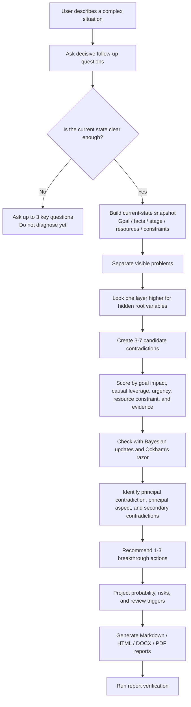

# Yao Crux Skill

[简体中文](README.md) | English

`yao-crux-skill` diagnoses complex real-world situations by clarifying the current state first, then separating the principal contradiction from secondary contradictions and turning the diagnosis into practical actions and multi-format reports.

Its core question is:

> If we can only focus on one root conflict at this stage, which one should we attack first?

## Best-Fit Scenarios

- Many problems are visible, but priority is unclear.
- Surface symptoms are loud, while the root cause is hidden.
- A team, business, operations, growth, product, delivery, or personal decision is stuck.
- Resources are limited, so not every problem can be handled at once.
- The user needs a structured diagnosis, action plan, probability projection, and formal report bundle.

It is not intended for pure philosophy summaries, historical text commentary, generic brainstorming, or final professional advice in medical, legal, investment, safety-critical, or similar domains.

## Core Logic

This skill does not rank problems by which one is loudest. It ranks contradictions by which one most determines the current stage's outcome.

It uses five layers of reasoning:

1. **Current-state clarity first**: If the goal, facts, stage, resources, constraints, and previous attempts are unclear, ask follow-up questions before diagnosing.
2. **Principal and secondary contradiction analysis**: Rewrite conflicts as `force A vs force B`, then identify which contradiction currently drives the situation.
3. **First-principles upward scan**: Move from visible symptoms to the upstream variable that can reduce several visible problems at once.
4. **Bayesian-style evidence updates + Ockham's razor**: Update candidate credibility with new facts; when candidates are close, prefer the one that explains more with fewer assumptions.
5. **Dynamic stage view**: The principal contradiction is stage-dependent. Once it changes, the next principal contradiction may emerge.

## Workflow



## Report Structure

A full report usually includes:

- **Conclusion first**: what to solve first, why it matters, and what to do next.
- **Current-state snapshot**: goal, facts, stage, resources, constraints, stakeholders, and previous attempts.
- **Clarity gate**: whether the available information is strong enough for diagnosis.
- **Fact vs judgment separation**: observed, estimated, and assumed statements.
- **Visual reasoning path**: how the diagnosis moves from user description to principal contradiction.
- **Iceberg model**: visible problems above the waterline and hidden root variables below.
- **Contradiction decision process**: candidates, evidence, scoring, and selection logic.
- **Principal contradiction**: the current stage's key bottleneck.
- **Secondary contradictions**: issues to monitor but not attack first.
- **Resource reallocation**: where time, attention, and resources should move.
- **Action plan**: 1-3 actions with owner, deadline, resources, metrics, and expected effect.
- **Probability projection**: baseline probability, action uplift, risk drag, and sensitivity.
- **Dynamic shift conditions**: when the principal contradiction should be re-evaluated.

## Report Generation

The input is a structured JSON file matching `templates/crux-report.schema.json`. The generator builds one canonical report and exports all formats from that same source so Markdown, HTML, Word, and PDF stay synchronized.

Quick run:

```bash
python3 scripts/generate_report_bundle.py input/github_examples/b2b_saas_sales_conversion_case.json reports/github-examples
python3 scripts/verify_report_bundle.py reports/github-examples
```

Generated files:

- `.report.json`: structured diagnosis data
- `.md`: versionable and collaboration-friendly report
- `.html`: navigable report with charts and print styling
- `.docx`: Word review and annotation format
- `.pdf`: formal distribution and archive format

HTML/PDF reports include five visual modules:

- analysis flow chart
- photo-based iceberg model
- contradiction decision matrix
- time/attention/resource allocation chart
- dynamic principal-contradiction transition map

## Strengths

- **Ask before judging**: prevents overconfident conclusions when the situation is unclear.
- **Finds upstream causes**: the principal contradiction can be a hidden root variable, not just a visible symptom.
- **Keeps theory practical**: principal and secondary contradictions are translated into user-facing labels such as "key bottleneck" and "monitor, but do not attack first."
- **Uses charts to explain reasoning**: visuals are tied to the logic, not decorative.
- **Keeps action narrow**: the default action plan focuses on 1-3 moves instead of a long task dump.
- **Treats probability as decision support**: projections include baseline, uplift, risk drag, and sensitivity instead of promises.
- **Stays reviewable**: every principal contradiction includes reversal conditions and review triggers.

## Public Examples

This public release includes three fictional business scenarios:

- `reports/github-examples/example-b2b-saas-sales-conversion.*`
- `reports/github-examples/example-ecommerce-inventory-cashflow.*`
- `reports/github-examples/example-customer-support-delivery.*`

Real user cases, private inputs, and local drafts are intentionally excluded from the public repository.

## Source Layout

- `SKILL.md`: routing rules and default workflow
- `references/`: questioning rules, contradiction model, report contract, and layout guidance
- `scripts/`: current-state clarity assessment, report generation, and report verification
- `templates/`: canonical report schema and HTML/PDF theme
- `input/`: template and fictional example inputs
- `evals/`: tests for clarity, first-principles reasoning, plain language, and visual reports
- `reports/github-examples/`: fictional example report bundles
