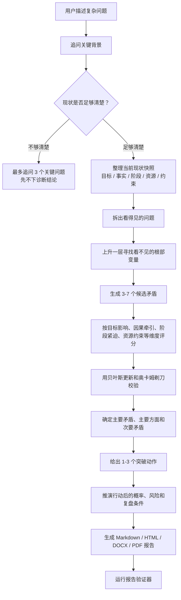

# Yao Crux Skill

简体中文 | [English](README.en.md)

`yao-crux-skill` 是一个用于复杂现实问题诊断的主次矛盾分析 Skill。它不会一上来就给结论，而是先通过追问把用户的当前现状讲清楚，再判断当前阶段真正决定局面走向的主要矛盾、需要盯住的次要矛盾，并把行动建议和结果概率整理成 `Markdown + HTML + DOCX + PDF` 报告。

它的核心问题是：

> 如果当前阶段只能集中解决一个根部冲突，应该先抓哪一个？

## 适合什么场景

- 事情很多，但不知道先解决哪一个
- 表面问题很多，背后的根因不明显
- 团队、业务、运营、增长、产品、交付或个人决策进入卡点
- 资源有限，不能所有问题同时处理
- 需要把分析过程、结论、行动建议和复盘条件整理成正式报告

不适合纯理论问答、历史文本解读、泛泛头脑风暴，或替代医疗、法律、投资、安全等专业意见。

## 底层逻辑

这个 Skill 的判断不是按“哪个问题声音最大”排序，而是按“哪个矛盾最决定当前阶段的整体结果”排序。

它使用五层逻辑：

1. **现状清晰度优先**：如果目标、事实、阶段、资源、约束和已尝试动作还不清楚，先追问，不急着诊断。
2. **主次矛盾判断**：把多个冲突写成 `力量 A 与 力量 B 的冲突`，再判断哪个矛盾在当前阶段最牵引结果。
3. **第一性原理上升一层**：从看得见的问题往上游找，看哪个根部变量一旦改变，能让多个表面问题一起变轻。
4. **贝叶斯式证据更新 + 奥卡姆剃刀**：用新事实修正候选矛盾的可信度；解释力接近时，优先选择能解释更多问题且假设更少的候选。
5. **动态阶段视角**：主要矛盾不是永久结论。当前主要矛盾缓解后，下一阶段可能出现新的主要矛盾。

## 处理流程



## 报告会包含什么

完整报告通常包含这些模块：

- **先看结论**：当前最该先解决什么，为什么是它，第一步做什么。
- **现状快照**：目标、事实、阶段、资源、约束、利益相关方和已尝试动作。
- **现状够不够清楚**：判断当前信息是否足够支撑诊断。
- **事实与判断分离**：标记哪些是已观察、估计或暂时假设。
- **一张图看懂分析路径**：从用户描述到主要矛盾的推理流程。
- **冰山模型**：区分水面上的问题和水面下的根部变量。
- **主要矛盾判断过程**：候选矛盾、证据、评分和选择逻辑。
- **主要矛盾（最关键的卡点）**：当前阶段最该主攻的冲突。
- **次要矛盾（先不主攻，但要盯住）**：暂缓处理的原因和触发条件。
- **资源重新分配**：时间、精力和资源应该从哪里挪到哪里。
- **行动建议**：1-3 个动作，包含负责人、截止时间、资源、指标和预计帮助。
- **结果概率推演**：不处理时的基线概率、行动增益、风险拖累和敏感性。
- **动态转移条件**：什么时候说明主要矛盾变了，需要重新判断。

## 报告生成方式

输入是一份结构化 JSON，符合 `templates/crux-report.schema.json`。生成脚本会基于同一份 canonical report 同步输出多种格式，避免 Markdown、HTML、Word 和 PDF 内容不一致。

快速运行：

```bash
python3 scripts/generate_report_bundle.py input/github_examples/b2b_saas_sales_conversion_case.json reports/github-examples
python3 scripts/verify_report_bundle.py reports/github-examples
```

生成结果：

- `.report.json`：结构化诊断结果，保留完整数据。
- `.md`：适合版本管理、复制和团队协作。
- `.html`：带图表、导航和打印样式的阅读版。
- `.docx`：适合 Word 审阅和批注。
- `.pdf`：适合正式分发和归档。

HTML/PDF 报告内置五类视觉模块：

- 分析流程图
- 照片式冰山模型
- 矛盾候选决策矩阵
- 时间/精力/资源倾斜图
- 主要矛盾动态转移图

## 主要特点

- **先追问，再判断**：避免信息不清时直接给漂亮但不可靠的结论。
- **找上游，而不是追着表象跑**：主要矛盾可以是不容易被用户直接看到的根部变量。
- **概念不空转**：`主要矛盾`、`次要矛盾` 会被翻译成可执行语言，比如 `最关键的卡点` 和 `先不主攻，但要盯住`。
- **图表服务推理**：图表用于说明分析逻辑，不只是装饰。
- **行动建议很窄**：默认只给 1-3 个突破动作，避免把报告写成任务清单堆砌。
- **概率是辅助决策，不是承诺**：报告会明确基线概率、行动增益、风险拖累和敏感性条件。
- **结论可复盘**：每个主要矛盾都有反转条件和复盘点。

## 公开示例

本公开版本包含三个虚构业务场景：

- `reports/github-examples/example-b2b-saas-sales-conversion.*`
- `reports/github-examples/example-ecommerce-inventory-cashflow.*`
- `reports/github-examples/example-customer-support-delivery.*`

真实用户案例、私有输入和本地过程材料不进入公开仓库。

## 目录结构

- `SKILL.md`：触发规则和默认工作流
- `references/`：追问规则、主次矛盾模型、报告契约和排版规则
- `scripts/`：现状清晰度判断、报告生成和报告验证
- `templates/`：结构化报告 schema 和 HTML/PDF 样式
- `input/`：模板和虚构示例输入
- `evals/`：现状清晰度、第一性原理、通俗表达和视觉报告测试
- `reports/github-examples/`：虚构示例报告包
