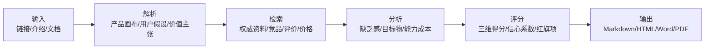
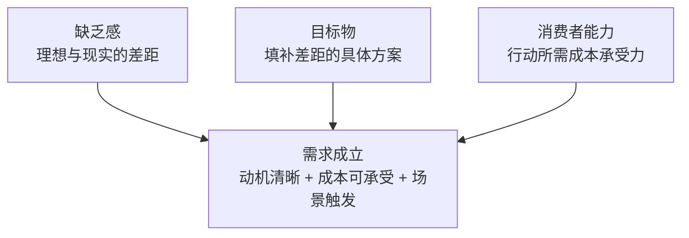

# 人形家用机器人需求诊断报告

> 人形家用机器人存在真实愿望和长期趋势，但当下家庭场景的需求成立被价格、能力边界、安全隐私和可获得性明显卡住，更适合先从高端试点、养老陪护和家政服务机构共创验证，而不是面向普通家庭规模化销售。

| 项目 | 结果 |
| --- | --- |
| 产品 | 人形家用机器人 |
| 日期 | 2026-06-12 |
| 目标市场 | 中国一二线城市中高收入家庭，重点覆盖家务辅助、银发陪护、居家安全和高端智能家居尝鲜人群 |
| 分析目标 | 新品类需求验证与商业化优先级判断 |
| 建议决策 | 重做定位 |

## 执行摘要

| 指标 | 读数 |
| --- | --- |
| 总分 | 4.3 |
| 缺乏感 | 6.7 |
| 目标物 | 5.6 |
| 消费者能力 | 3.5 |
| 证据信心 | 0.82 |

**最大机会：** 老龄化、家政服务缺口、智能家居普及和家庭自动化愿望共同形成长期需求土壤；如果能把任务范围收窄到高频、低风险、可验证的家庭任务，需求会明显增强。

**最大风险：** 真实家庭环境开放且不规则，当前通用家务能力、远程操作隐私、物理安全、价格和售后责任都没有达到普通家庭放心购买的门槛。

**下一步策略：** 用高端家庭和机构共创证明有限任务价值，用隐私安全和租赁服务降低入户门槛，再逐步扩大家庭任务边界。

## 可视化诊断

Markdown 版本保留图表等价数据，但把判断放在数据前面，便于先读结论再看明细。

### 01. 总分诊断：愿望强，家庭购买能力不足

**类型：** `score_gauge`
**置信度 0.82 | S1 S7 S9 S10 S12**

**解读：** 总分处在脆弱区间，说明品类长期方向成立，但现在不适合按普通家电逻辑直接规模化销售。

**建议：** 先把入口市场从普通家庭改为高端试点、养老陪护和家政/机构共创。

| 分组 | 指标/情景 | 数值/X | Y/说明 |
| --- | --- | --- | --- |
|  | 需求总分 | 4.3 | 重定入口市场 |

### 02. 需求三角雷达：消费者能力拖后腿

**类型：** `radar`
**置信度 0.80 | S1 S10 S12 S13**

**解读：** 缺乏感不低，目标物也有雏形；真正限制需求成立的是家庭能否放心、负担并持续使用。

**建议：** 所有迭代优先围绕降成本、降风险、降信任门槛，而不是继续堆叠能力演示。

| 分组 | 指标/情景 | 数值/X | Y/说明 |
| --- | --- | --- | --- |
|  | 缺乏感 | 6.7 |  |
|  | 目标物 | 5.6 |  |
|  | 消费者能力 | 3.5 |  |

### 03. 三大维度短板：先修能力成本

**类型：** `bar`
**置信度 0.84 | S1 S10 S13**

**解读：** 能力成本低到足以否定规模化家庭购买，继续强化愿景不会自动转化为订单。

**建议：** 先用订阅、保险、可退押金、上门服务和透明隐私协议重构购买门槛。

| 分组 | 指标/情景 | 数值/X | Y/说明 |
| --- | --- | --- | --- |
|  | 缺乏感 | 6.7 |  |
|  | 目标物 | 5.6 |  |
|  | 消费者能力 | 3.5 |  |

### 04. 子项热力图：钱、信任、风险是红区

**类型：** `heatmap`
**置信度 0.78 | S10 S12 S13 S14**

**解读：** 热力图显示最弱项并非用户没有需求，而是用户不敢让设备进入家庭核心空间。

**建议：** 先把隐私、安全、故障和责任做成产品的一等功能。

| 分组 | 指标/情景 | 数值/X | Y/说明 |
| --- | --- | --- | --- |
| 缺乏感 | 强度 | 7.0 |  |
| 缺乏感 | 频率 | 8.0 |  |
| 缺乏感 | 紧迫 | 5.0 |  |
| 缺乏感 | 趋势 | 9.0 |  |
| 目标物 | 匹配 | 6.0 |  |
| 目标物 | 清晰 | 7.0 |  |
| 目标物 | 验证 | 3.5 |  |
| 目标物 | 见效 | 4.0 |  |
| 能力 | 金钱 | 2.5 |  |
| 能力 | 行动 | 4.0 |  |
| 能力 | 信任 | 2.5 |  |
| 能力 | 风险 | 2.5 |  |

### 05. 缺乏感结构：趋势强，紧迫性一般

**类型：** `radar`
**置信度 0.79 | S5 S6 S7 S9**

**解读：** 用户知道家务和照护很痛，也相信自动化是趋势，但短期仍可用人工服务和单任务设备替代。

**建议：** 不要抽象讲未来家庭，应聚焦老人安全、夜间巡检、取物递送等更有触发感的场景。

| 分组 | 指标/情景 | 数值/X | Y/说明 |
| --- | --- | --- | --- |
|  | 强度 | 7.0 |  |
|  | 频率 | 8.0 |  |
|  | 紧迫 | 5.0 |  |
|  | 认知 | 7.0 |  |
|  | 趋势 | 9.0 |  |
|  | 付费 | 5.0 |  |

### 06. 目标物结构：概念清楚，实证不足

**类型：** `radar`
**置信度 0.76 | S1 S2 S3 S11**

**解读：** 人形形态的差异化明确，但真实家庭任务完成率、失败恢复和长期复用还缺少强证据。

**建议：** 先公开有限任务的家庭测试基准，而不是只展示实验室或舞台能力。

| 分组 | 指标/情景 | 数值/X | Y/说明 |
| --- | --- | --- | --- |
|  | 任务匹配 | 6.0 |  |
|  | 清晰 | 7.0 |  |
|  | 差异 | 7.0 |  |
|  | 证据 | 3.5 |  |
|  | 品类 | 5.0 |  |
|  | 见效 | 4.0 |  |

### 07. 消费者能力：隐私和价格同时压制

**类型：** `radar`
**置信度 0.82 | S1 S12 S13 S15**

**解读：** 高端用户可能愿意展示科技形象，但普通家庭很难同时接受高价、摄像头、机械臂和远程接管。

**建议：** 把遥操作状态、录像边界、数据用途和本地控制做成可见、可审计、可撤销的机制。

| 分组 | 指标/情景 | 数值/X | Y/说明 |
| --- | --- | --- | --- |
|  | 金钱 | 2.5 |  |
|  | 行动 | 4.0 |  |
|  | 学习 | 5.0 |  |
|  | 信任 | 2.5 |  |
|  | 风险 | 2.5 |  |
|  | 形象 | 6.0 |  |
|  | 可得 | 3.0 |  |

### 08. 人群机会矩阵：先吃高端与机构共创

**类型：** `matrix`
**置信度 0.74 | S7 S9 S10**

**解读：** 老人家庭需求最强但采用能力不高；高净值家庭和机构共创客户更适合作为早期入口。

**建议：** 用机构和高端家庭积累场景，再把验证后的任务包下沉到老人家庭。

| 分组 | 指标/情景 | 数值/X | Y/说明 |
| --- | --- | --- | --- |
|  | 高端尝鲜家庭 | 5.8 | 6.5 |
|  | 独居老人家庭 | 4.2 | 8.2 |
|  | 双职工育儿家庭 | 4.8 | 7.0 |
|  | 高净值管家家庭 | 6.0 | 7.5 |
|  | 机构共创客户 | 6.5 | 7.8 |

### 09. 替代方案矩阵：成熟替代品更可买

**类型：** `matrix`
**置信度 0.78 | S1 S3 S4 S5 S9**

**解读：** 人形机器人覆盖面看起来更大，但购买确定性低；扫地机、智能家居和人工服务更容易成交。

**建议：** 定位上不要直接替代全部家政，应先补成熟替代品做不了的夜间、跨设备和陪伴巡检任务。

| 分组 | 指标/情景 | 数值/X | Y/说明 |
| --- | --- | --- | --- |
|  | 人形家用机器人 | 6.2 | 3.5 |
|  | 1X NEO | 6.0 | 3.2 |
|  | Figure 03 | 6.5 | 2.8 |
|  | Unitree 硬件 | 4.5 | 4.5 |
|  | 扫地机智能家居 | 3.8 | 8.3 |
|  | 人类家政护工 | 7.0 | 6.0 |
|  | 不购买观望 | 1.5 | 9.0 |

### 10. 采用漏斗：从愿望到持续使用急剧收缩

**类型：** `funnel`
**置信度 0.68 | S1 S12 S13**

**解读：** 最大流失不在认知层，而在入户许可、高价购买和持续任务价值。

**建议：** 漏斗优化要从隐私授权、可退试用和任务复用率开始，不要只做品牌教育。

| 分组 | 指标/情景 | 数值/X | Y/说明 |
| --- | --- | --- | --- |
|  | 知道愿望 | 100.0 |  |
|  | 愿意了解 | 72.0 |  |
|  | 接受入户 | 36.0 |  |
|  | 接受高价 | 18.0 |  |
|  | 接受试点 | 10.0 |  |
|  | 持续使用 | 5.0 |  |

### 11. 证据结构：政策与官方多，用户留存少

**类型：** `stacked_bar`
**置信度 0.75 | S1 S5 S8 S9 S11**

**解读：** 证据偏向供给侧和趋势侧，缺少真实家庭长期使用数据，因此不能高估需求确定性。

**建议：** 下一轮必须补真实家庭访谈、上门试用和 30 天留存数据。

| 分组 | 指标/情景 | 数值/X | Y/说明 |
| --- | --- | --- | --- |
|  | 官方产品 | 5 |  |
|  | 政策行业 | 5 |  |
|  | 媒体实测 | 4 |  |
|  | 用户反馈 | 1 |  |
|  | 假设 | 3 |  |

### 12. 风险矩阵：隐私、安全、能力落差最危险

**类型：** `matrix`
**置信度 0.84 | S10 S12 S13 S14 S15**

**解读：** 风险并非附属问题，而是直接决定用户是否允许机器人进家的购买条件。

**建议：** 先发布家庭安全白皮书、隐私控制台、遥操作标识和保险责任方案。

| 分组 | 指标/情景 | 数值/X | Y/说明 |
| --- | --- | --- | --- |
|  | 隐私远程操作 | 8.0 | 9.0 |
|  | 物理安全 | 7.0 | 9.0 |
|  | 价格过高 | 8.0 | 8.0 |
|  | 能力不达预期 | 8.0 | 8.0 |
|  | 售后维护 | 6.0 | 7.0 |
|  | 监管责任 | 5.0 | 8.0 |

### 13. 建议优先级：别先做全能家务

**类型：** `matrix`
**置信度 0.76 | S9 S10 S13**

**解读：** 通用家务全自动价值大但难度最高，短期更适合先做养老陪护、隐私机制和机构共创。

**建议：** 产品路线应从可控高价值任务切入，再逐步扩大自动化边界。

| 分组 | 指标/情景 | 数值/X | Y/说明 |
| --- | --- | --- | --- |
|  | 养老陪护 MVP | 4.0 | 8.0 |
|  | 隐私本地化 | 6.0 | 9.0 |
|  | RaaS 降价 | 7.0 | 8.0 |
|  | 家政机构共创 | 5.0 | 7.0 |
|  | 高端试点 | 4.0 | 6.0 |
|  | 通用家务全自动 | 9.0 | 9.0 |

### 14. 情景预测：重定位后才有上升空间

**类型：** `forecast`
**置信度 0.73 | S1 S9 S10**

**解读：** 如果仍按概念预售推进，需求分数难明显改善；若先验证养老/机构场景并降低能力成本，才可能进入可验证区间。

**建议：** 用 90 天试点证明安全、价格和任务复用，再讨论面向家庭扩大销售。

| 分组 | 指标/情景 | 数值/X | Y/说明 |
| --- | --- | --- | --- |
|  | 概念预售 | 4.3 | 低 |
|  | 养老共创 | 5.8 | 中 |
|  | 安全降价 | 6.9 | 中高 |

## 产品概览

**产品定义：** 面向家庭环境的具身智能人形机器人，采用双足或类人移动形态，能通过视觉、语音和机械臂在家中完成取物、整理、提醒、陪伴、巡检、简单家务和智能家居控制等任务。

**价值主张：** 把家庭中反复出现、耗时、分散且难以标准化的家务和照护任务，转化为可委托、可监督、可逐步学习的实体执行能力。

**核心功能：**

- 语音对话、家庭成员识别和场景记忆
- 取物、递送、开门、简单收纳和桌面整理
- 洗衣、叠衣、厨房辅助等低速家务试点任务
- 老人陪伴、用药/喝水提醒、跌倒巡检和异常通知
- 夜间安全巡逻、门窗/燃气/宠物状态检查
- 与智能门锁、灯光、空调、安防和家庭日历联动
- 远程专家模式或云端辅助，用于处理超出自主能力的复杂任务
- 任务日志、隐私授权、安全刹停、儿童/宠物避让和保险责任机制

**定价与商业模式：**

- 1X 官方 NEO 页面披露早期接入可选择 20000 美元购买或 499 美元/月订阅，并计划 2026 年在美国交付早期订单 [S1]。
- Unitree 官方商店显示人形机器人硬件从 4900 美元起到 100000 美元级别不等，但这些型号更多面向开发、展示、科研或行业场景 [S4]。
- 国内媒体和行业分析普遍认为，真正进入家庭需要把整机价格从数十万元级继续压到约 10 万元人民币或更低，并建立售后、保险和安全标准 [S10]。
- 家庭服务机器人也可能采用硬件销售 + 订阅、RaaS 租赁、远程专家服务、家政/养老机构共创和保险售后打包模式。
- 硬件销售或租赁 + 月度订阅/RaaS + 远程专家服务 + 家庭安全/养老服务包 + 维保保险 + 与家政、养老、地产和智能家居生态合作。

**假设：**

- 本报告把“人形家用机器人”定义为可进入真实家庭环境的服务机器人，不把工厂搬运、科研竞赛和舞台展示作为主要需求证据。
- 没有单一品牌输入时，评分以品类需求成立度为对象，而不是评价某一家公司的技术实力。
- 公开资料中家庭部署数据有限，因此用户口碑和真实留存仍是最弱证据层。

## 研究方法与来源

用户输入为品类方向而非具体 SKU。本报告检索截至 2026-06-12 的官方产品页、行业报告、政策与媒体实测/评论；工业、科研和商用人形机器人只作为能力边界、价格区间和替代方案证据，不把其订单直接等同于家庭购买需求。

- **S1** [1X NEO Home Robot Order Page](https://www.1x.tech/order) · A · official product/order page · 2026-06-12
  - NEO Home Robot 提供 499 美元/月订阅和 20000 美元购买选项。；官网说明早期美国交付从 2026 年开始，复杂任务可使用 Expert Mode 远程专家辅助。
- **S2** [1X NEO Product Page](https://www.1x.tech/neo) · A · official product page · 2026-06-12
  - 官网描述 NEO 可在家庭中执行开门、洗衣等任务，并使用 Redwood AI 和 Expert Mode。；官方叙事明确把家庭场景作为核心方向。
- **S3** [Figure AI Official Website](https://www.figure.ai/) · A · official product/company page · 2026-06-12
  - Figure 03 被官方描述为面向 everyday 场景的通用人形机器人。；官方提到 Helix 能处理家庭环境和家务任务。
- **S4** [Unitree Humanoid Robot Shop](https://shop.unitree.com/collections/humanoid-robot) · A · official product/shop page · 2026-06-12
  - Unitree 官方商店列出多款人形机器人，价格从 4900 美元起到 100000 美元级别。；这些产品更偏开发、科研、展示和行业硬件，不等同于完整家用服务产品。
- **S5** [IFR: Service Robots See Global Growth Boom](https://ifr.org/ifr-press-releases/news/service-robots-see-global-growth-boom) · A · industry report / association press release · 2026-06-12
  - IFR 报道服务机器人市场增长，消费服务机器人 2024 年销量接近 2000 万台。；家庭任务类是消费服务机器人中最大的类别。
- **S6** [World Robotics 2025 Service Robots Executive Summary](https://www.diag.uniroma1.it/~deluca/rob1_en/2025_WorldRobotics_ExecSummary_Service.pdf) · A · industry report PDF · 2026-06-12
  - 消费机器人接近 2010 万台，家庭任务占消费机器人绝大多数。；care-at-home 机器人登记销量仍很低，说明家庭照护型机器人尚未规模化。
- **S7** [国家统计局：2025 年人口数据解读](https://www.stats.gov.cn/xxgk/jd/sjjd2020/202601/t20260119_1962338.html) · A · official statistics · 2026-06-12
  - 2025 年中国 60 岁及以上人口超过 3.23 亿，65 岁及以上人口超过 2.23 亿。；城镇化率继续提升，家庭服务与照护场景会更多集中在城市家庭。
- **S8** [新华社：工信部印发人形机器人创新发展指导意见](https://www.news.cn/tech/20231103/f76096318e964b13a8c31011de8cda2a/c.html) · A · policy news / official media · 2026-06-12
  - 指导意见把人形机器人视为战略产品，并提出到 2025 年初步建立创新体系、实现批量生产和示范应用。；到 2027 年形成产业生态，并拓展到医疗、家政、民生服务等场景。
- **S9** [新华社瞭望：AI 重塑家政服务](https://www.news.cn/tech/20260203/f213de0442a247c4873895b65307c3d9/c.html) · B · official media / industry analysis · 2026-06-12
  - 国内家政服务市场规模和从业人数庞大，存在匹配、标准化、培训和质量问题。；报道提到陪伴机器人和家务机器人在机构、社区和家庭场景探索，但也强调成本、技术适配、隐私和复杂动作仍是障碍。
- **S10** [数字中国/经济日报：人形机器人何时进入百姓家](https://www.digitalchina.gov.cn/2025/xwzx/szkx/202505/t20250512_5017222.htm) · B · official media / industry analysis · 2026-06-12
  - 报道认为工业制造等结构化场景更可能先商业落地，家庭场景仍需要时间。；人形机器人进入家庭需要价格下降、安全稳定、标准、保险、维护和生态配套。
- **S11** [TIME: Figure 03 Humanoid Robot Reveal](https://time.com/7324233/figure-03-robot-humanoid-reveal/) · B · third-party media · 2026-06-12
  - 媒体报道 Figure 03 面向家庭目标，但演示和实际落地仍显示其尚未准备好面向普通家庭大规模使用。；真实家庭数据和任务可靠性仍是关键缺口。
- **S12** [Tom's Guide: NEO Home Robot Privacy and Teleoperation Concerns](https://www.tomsguide.com/home/smart-home/the-neo-home-robot-thats-breaking-the-internet-promises-to-change-the-world-but-theres-one-huge-problem) · B · third-party media / critique · 2026-06-12
  - 报道提到 NEO 的价格和月费，并重点质疑远程操作、摄像头和家庭隐私问题。；文章提醒用户谨慎看待早期预订承诺。
- **S13** [TechRadar: NEO Robot Privacy Concerns](https://www.techradar.com/ai-platforms-assistants/neo-robot-sounds-like-the-answer-to-our-home-chore-prayers-but-also-a-potential-privacy-nightmare) · B · third-party media / critique · 2026-06-12
  - 报道讨论 NEO 的遥操作、家庭数据和隐私边界。；文章指出家庭机器人需要明确数据控制、限制和类似 GDPR 的保护。
- **S14** [European Commission: AI Act Regulatory Framework](https://digital-strategy.ec.europa.eu/en/policies/regulatory-framework-ai) · A · regulatory source · 2026-06-12
  - 欧盟 AI Act 是按风险分层治理 AI 的综合框架。；高风险 AI 需要更严格的合规和风险管理。
- **S15** [EU AI Act Article 6: Classification Rules for High-Risk AI Systems](https://artificialintelligenceact.eu/article/6/) · B · legal reference · 2026-06-12
  - 若 AI 系统作为特定产品安全组件或落入高风险场景，可能被归入高风险 AI。；家用人形机器人涉及物理世界和安全影响，需提前考虑风险治理。

## 目标用户与 JTBD

### 高端尝鲜家庭

- **场景：** 已购买高端智能家居、扫地机、安防设备和新能源车，愿意为前沿科技体验付费。
- **JTBD：** 让家里拥有一个可展示、可体验、能做少量实事的未来家庭助手。
- **当前替代：** 智能音箱和全屋智能；扫地/洗地/割草机器人；家政服务；不买，继续观望
- **采用阻碍：** 价格与实际任务价值不匹配；远程操作和摄像头入户带来的隐私担忧；儿童、宠物和老人场景下的安全责任；售后维护和占用空间

### 双职工育儿家庭

- **场景：** 工作日时间紧张，希望降低打扫、收纳、照看孩子和家庭提醒的负担。
- **JTBD：** 减少碎片化家务和提醒任务，让父母下班后少花时间处理琐事。
- **当前替代：** 钟点工和保姆；扫地机、洗地机、洗碗机、烘干机；家庭成员分工；儿童看护设备
- **采用阻碍：** 不能替代真正育儿和复杂家务；儿童安全风险；学习和设置成本；家庭隐私和噪音

### 独居或半自理老人家庭

- **场景：** 老人需要陪伴、提醒、巡检和简单协助，子女希望远程确认状态。
- **JTBD：** 在不长期雇佣护工的情况下，提高老人居家安全感和子女的可知情程度。
- **当前替代：** 护工和保姆；智能摄像头、呼叫器和穿戴设备；社区养老服务；养老机构
- **采用阻碍：** 老人对机器人形态和操作的接受度；跌倒、服药和突发事件责任边界；隐私和远程监控授权；维护、上门服务和设备故障应急

### 高净值家庭/家庭管家替代

- **场景：** 已有长期家政或管家支出，希望机器人承担夜间巡检、简单服务和可展示任务。
- **JTBD：** 把一部分可标准化服务交给机器人，同时提升家庭科技形象和服务连续性。
- **当前替代：** 全职保姆/管家；物业管家；智能家居中控；安防服务
- **采用阻碍：** 机器人不能处理复杂非标服务；昂贵设备与人工成本的替代账算不清；高端家庭对隐私泄露零容忍；售后响应必须接近家电/汽车级

### 家政/养老机构共创客户

- **场景：** 机构希望通过机器人降低人力压力、展示科技能力，并积累可复制服务流程。
- **JTBD：** 先在半结构化环境中验证任务库、成本模型和服务责任，再逐步复制到家庭。
- **当前替代：** 服务机器人；呼叫系统和摄像巡检；护工排班系统；人工培训和标准化流程
- **采用阻碍：** 采购预算和 ROI；责任事故和保险；员工协同成本；技术展示与真实效率之间的落差

## 竞品与替代方案

### 1X NEO · `direct`

- **定位：** 面向家庭的 NEO Home Robot，官方披露购买或订阅方案，并使用 Redwood AI 与 Expert Mode 处理部分复杂任务。
- **优势：** 明确面向家庭场景；有官方定价和早期交付计划；远程专家模式可能补足早期自主能力
- **弱点：** 价格和订阅成本很高；远程操作引发隐私和信任问题；早期自主能力边界仍需验证
- **来源：** S1 S2 S12 S13

### Figure 03 · `direct`

- **定位：** Figure 官方强调面向日常场景和家庭环境的通用人形机器人。
- **优势：** 品牌和融资关注度高；主张 Helix 能理解家庭环境和处理家务任务；硬件形态更接近通用家用机器人想象
- **弱点：** 尚未形成普通家庭可购买产品；媒体测试和披露显示家庭应用仍处于早期；真实家庭数据和任务可靠性不足
- **来源：** S3 S11

### Unitree 人形机器人 · `indirect`

- **定位：** 以开发者、科研、展示和行业客户为主的人形机器人硬件平台，价格覆盖较广。
- **优势：** 硬件价格区间下降速度快；国内供应链和开发者生态强；对行业教育和能力边界有示范价值
- **弱点：** 不是完整家用服务产品；家庭任务、售后、隐私和安全包装不足；消费者购买理由不如行业客户清晰
- **来源：** S4

### 扫地机、洗地机和智能家居 · `substitute`

- **定位：** 针对单一家庭任务的成熟机器人和智能设备组合。
- **优势：** 价格低、效果明确；隐私和安全风险小；已被家庭广泛接受
- **弱点：** 不能处理跨房间、多步骤和非结构化家务；陪伴和照护能力有限
- **来源：** S5 S6

### 人类家政和护工 · `manual`

- **定位：** 最直接满足家务和照护需求的人工服务。
- **优势：** 处理非标任务能力强；情绪劳动和照护责任更成熟；可按需购买服务时间
- **弱点：** 服务质量不稳定；长期成本高；匹配、培训和信任成本持续存在
- **来源：** S9

### 不购买/继续等待 · `non_consumption`

- **定位：** 用户把人形家用机器人视为未来产品，但短期不承担价格、隐私和安全风险。
- **优势：** 零支出、零入户风险；等待技术成熟和价格下降；继续使用现有设备和人工服务
- **弱点：** 无法获得早期自动化和陪伴体验；不能解决家务和照护人力缺口

## 需求三角分析

### 缺乏感：6.7

**推理：** 缺乏感真实存在，但它首先指向家务和照护问题，而不是必然指向人形形态。老龄化、家政服务成本和家庭自动化趋势让长期需求有基础；短期弱点在于用户对“现在就买一台类人机器人进家”的迫切性和付费意愿不足。

**支持证据：**

- 中国 60 岁及以上人口已超过 3.2 亿，老龄化与家庭照护压力构成长期需求底盘 [S7]。
- 国内家政服务市场规模和从业人数庞大，且存在匹配、标准化和培训成本问题，说明家庭服务确实有持续痛点 [S9]。
- IFR 数据显示消费服务机器人接近 2000 万台年销量，家庭任务类占比极高，家庭自动化意愿已经被单任务机器人验证 [S5][S6]。
- 政策层面明确把人形机器人视为战略产品，并提到未来拓展到医疗、家政、民生服务等场景 [S8]。

**反证或缺口：**

- 家庭并不一定缺“人形机器人”，很多家庭只缺更便宜可靠的扫地、收纳、照护提醒或家政服务。
- 完整人形机器人属于高价、低频、强信任产品，用户紧迫性明显低于刚需家电和人工服务。
- IFR 同期数据显示 care-at-home 机器人登记销量很低，家庭照护型机器人并未被大规模购买验证 [S6]。

**改进路径：** 把宏大的家用机器人愿景拆成高频、可量化、低风险的场景：老人夜间巡检、取物递送、用药提醒、异常通知、简单整理，并用真实家庭试点证明用户愿意为这些任务持续付费。

### 目标物：5.6

**推理：** 目标物有强想象和一定产品雏形，但距离“家庭购买后稳定完成核心任务”还有明显证据缺口。它更像早期通用平台，而不是已经被充分证明的家用产品。当前最有机会的目标物不是“全能机器人”，而是“可监管的家庭任务执行终端”。

**支持证据：**

- 1X NEO 和 Figure 03 都把家庭、日常任务和家务协助作为公开叙事，说明目标物方向清晰 [S1][S2][S3]。
- 人形形态相对单任务机器人有跨房间、使用人类工具、与家庭成员互动的差异化想象。
- Unitree 等平台把硬件价格和可获得性向下推进，但更多仍是开发和行业硬件，不等同于完整家庭产品 [S4]。

**反证或缺口：**

- 公开资料显示家庭场景下的完整自主能力仍不成熟，部分复杂任务需要远程专家或人工遥操作 [S1][S2][S11][S12]。
- 单任务家电和人工家政在大多数家庭任务上更便宜、更确定、更容易被接受。
- “类人形态”带来展示价值，也带来机械安全、空间占用、恐惧感和隐私审查成本。

**改进路径：** 把目标物从全能管家重定位为可解释、可授权、可远程接管的家庭任务机器人；先证明 5 个任务的完成率、失败恢复、用户复用率和事故率，再扩展通用家务。

### 消费者能力：3.5

**推理：** 消费者能力是当前最大短板。即使需求愿望和产品叙事成立，家庭要把一个带摄像头、机械臂、可能远程接管的昂贵设备放进私密空间，需要同时跨过金钱、信任、安全、维护和责任边界。普通家庭短期很难承受这组成本。

**支持证据：**

- 1X NEO 官方披露的购买价和订阅价对普通家庭仍属高门槛 [S1]。
- 行业观点认为人形机器人进入家庭还需要价格下降、安全稳定、标准、保险、维护和生态配套 [S10]。
- 媒体对 NEO 的评论集中质疑远程操作和家庭数据隐私，这会显著推高信任成本 [S12][S13]。
- 欧盟 AI Act 等风险监管框架显示，具备物理交互和安全影响的 AI 产品需要更严格的风险治理 [S14][S15]。

**反证或缺口：**

- 高端尝鲜家庭和机构客户能承受更高价格，并愿意为展示、陪伴或服务创新付费。
- 订阅/RaaS、押金可退、保险和上门维保可降低一次性购买阻力。
- 如果机器人只进入半结构化空间或限定任务，安全和隐私成本可以被局部压低。

**改进路径：** 不要先要求普通家庭购买整机；先用机构共创、押金试用、月租保险包、本地隐私模式、清晰遥操作授权和有限任务库降低能力成本。

## 评分与解释

| 维度 | 分数 |
| --- | --- |
| 缺乏感 | 6.7 |
| 目标物 | 5.6 |
| 消费者能力 | 3.5 |
| 证据信心 | 0.82 |
| 总分 | 4.3 |

## 建议与实验

### P0 · 入口市场

**建议：** 不要把首个商业化目标定义为普通家庭全能管家，应重定位为高端家庭试点、养老陪护 MVP 和家政/养老机构共创。

- **理由：** 普通家庭的金钱、信任和安全门槛过高；机构和高端家庭更能承受早期产品的不确定性。
- **预期影响：** 提高试点成交率和有效反馈密度，减少因能力落差造成的品牌损伤。
- **执行成本：** 中

### P0 · 隐私与安全

**建议：** 把本地隐私模式、远程接管可见提示、数据用途开关、物理急停、儿童/宠物安全和保险责任写进产品默认体验。

- **理由：** 家庭场景不是办公室或工厂，隐私和物理安全是购买前置条件。
- **预期影响：** 降低入户许可阻力，提升家庭成员共同决策通过率。
- **执行成本：** 高

### P1 · 任务库

**建议：** 先固定 5 个低风险高频任务：取物递送、用药/喝水提醒、夜间巡检、简单整理、智能家居联动。

- **理由：** 有限任务可以被定义、测试和改进，比“全能家务”更容易形成真实购买理由。
- **预期影响：** 提高用户对实际价值的感知，并形成可复用的家庭任务数据。
- **执行成本：** 中

### P1 · 价格模型

**建议：** 采用押金可退、短期租赁、含保险和维保的 RaaS，而不是要求用户一次性承担整机购买。

- **理由：** 人形家用机器人价格和故障风险都高，租赁和保障能降低试错成本。
- **预期影响：** 扩大可试用人群，并提升真实需求验证速度。
- **执行成本：** 中高

### P1 · 渠道

**建议：** 优先绑定养老机构、家政公司、高端物业和智能家居集成商，构建半结构化试点场景。

- **理由：** 这些渠道能提供明确场景、维护能力和责任接口，比直接卖给散户更稳。
- **预期影响：** 降低落地复杂度，形成家庭销售前的示范案例。
- **执行成本：** 中

### P2 · 证据建设

**建议：** 公开家庭场景测试基准：任务完成率、失败恢复时间、误触发率、隐私授权率、30 天复用率和事故率。

- **理由：** 当前证据偏供给侧，用户需要看到家庭真实环境下的可重复结果。
- **预期影响：** 提升目标物证明强度，为下一轮融资、渠道和销售提供可信材料。
- **执行成本：** 中

### 验证实验

**实验 1：高净值家庭愿意为可监管的家庭任务机器人支付月租，而不是购买高价整机。**

- **分群：** 高端尝鲜家庭
- **方法：** 30 户深访 + 价格敏感度 fake-door 页面 + 可退押金测试
- **指标：** 押金转化率、愿意月租区间、隐私条款接受率
- **阈值：** 可退押金转化率达到 8% 以上，且 30% 以上样本接受 3000 元/月以上服务包
- **决策规则：** 未达阈值则停止直接家庭预售，转向机构共创

**实验 2：老人家庭更愿意购买夜间巡检和异常通知，而不是抽象陪伴。**

- **分群：** 独居或半自理老人家庭
- **方法：** 20 户老人家庭 Wizard-of-Oz 试点，机器人部分任务由人工遥操作模拟
- **指标：** 任务复用率、老人抵触率、子女付费意愿、异常通知信任度
- **阈值：** 30 天内每户每周复用 4 次以上，子女愿付费比例超过 40%
- **决策规则：** 若复用集中在巡检和提醒，则优先养老安全 MVP

**实验 3：透明遥操作和本地隐私控制能显著提升入户接受率。**

- **分群：** 双职工育儿家庭
- **方法：** A/B 展示三种隐私方案：默认云端、可见遥操作、本地优先且可撤销授权
- **指标：** 入户同意率、儿童场景接受率、数据上传授权率
- **阈值：** 本地优先方案的入户同意率比默认云端高 30% 以上
- **决策规则：** 若差异显著，则把本地隐私控制作为核心卖点

**实验 4：家政/养老机构可以先承接早期机器人维护和任务标准化。**

- **分群：** 家政/养老机构共创客户
- **方法：** 2 家机构 60 天试点，比较机器人辅助前后的巡检、人力响应和客户满意度
- **指标：** 人均服务时长下降、故障响应时间、机构续租意愿
- **阈值：** 单项流程节省 15% 以上人力时间，机构愿意续租或共同采购
- **决策规则：** 达标则优先 B2B2C 渠道，不达标则缩小任务范围

**实验 5：用户更愿意为结果付费，而不是为人形硬件本身付费。**

- **分群：** 高净值家庭/家庭管家替代
- **方法：** 比较三种报价：整机购买、月租硬件、按任务/安全服务包收费
- **指标：** 报价偏好、拒绝原因、可接受服务等级
- **阈值：** 服务包偏好超过整机购买 2 倍
- **决策规则：** 若成立，则销售话术从硬件参数改为服务结果和责任保障

## 风险与伦理

### 高风险 · 隐私

**风险：** 摄像头、麦克风、家庭地图和远程操作会让用户担心私人空间被记录或外部人员访问。

**缓释：** 默认本地处理敏感数据；远程操作必须显著提示、授权、可回放审计，并允许用户一键关闭。

**来源：** S12 S13

### 高风险 · 安全

**风险：** 机械臂、移动底盘和双足运动可能对儿童、老人、宠物和家具造成伤害。

**缓释：** 限定速度和力矩，建立家庭安全区、急停按钮、碰撞日志和第三方保险。

**来源：** S10 S15

### 高风险 · 能力落差

**风险：** 宣传中的全能家务与真实家庭非结构化环境之间存在巨大落差，容易造成退货和口碑反噬。

**缓释：** 只承诺通过测试的有限任务；所有演示标注自主、半自主或远程辅助状态。

**来源：** S1 S2 S11 S12

### 高风险 · 价格

**风险：** 整机和订阅价格过高，用户很难把价值与家政、护工、扫地机等替代方案算清楚。

**缓释：** 提供租赁、押金试用、分任务服务包和明确的人工替代成本对比。

**来源：** S1 S4 S10

### 中风险 · 售后责任

**风险：** 家庭机器人故障需要上门维护、备用方案和事故处理，传统电子产品售后不足以覆盖。

**缓释：** 用汽车/家电级维保网络、备用设备和 SLA 合同支撑早期客户。

**来源：** S10

### 中风险 · 监管

**风险：** 具备物理交互和安全影响的 AI 产品可能面临高风险 AI、产品安全、数据合规和责任认定要求。

**缓释：** 从试点阶段就建立风险评估、数据治理、日志审计和第三方安全认证。

**来源：** S14 S15

## 预测情景

- 预测窗口：未来 12-24 个月，以中国一二线城市高收入家庭和机构试点为主要观察窗口
- 置信度：0.73
- 复盘触发：当出现 1000 户以上真实家庭部署、30 天留存和任务完成率公开数据，或出现低于 10 万元人民币且含维保保险的可靠家用型号时，应重新评分。

| 情景 | 预测分数 | 采用可能性 | 关键假设 |
| --- | --- | --- | --- |
| 概念预售继续推进 | 4.3 | 低 | 继续以全能家务和未来家庭为主叙事；价格、隐私、遥操作和任务完成率没有透明改善；用户更多围观和试用，普通家庭购买转化低 |
| 养老/机构共创优先 | 5.8 | 中 | 先在养老、家政和高端物业中验证巡检、提醒、递送任务；采用租赁和保险服务包降低购买门槛；积累可公开的家庭任务基准和真实复用数据 |
| 安全、价格和能力同时改善 | 6.9 | 中高 | 整机或服务包价格显著下降；本地隐私、远程授权、物理安全和售后责任成为行业默认配置；至少 5 个家庭任务在 30 天试点中证明高复用和低事故率 |

## 最终方案

**最终判断：** 人形家用机器人不是没有需求，而是当前需求被消费者能力短板压住。现阶段不宜按普通消费电子直接规模化销售，应先做重定位：从全能家庭管家转向可监管的高价值家庭任务机器人。

**总体策略：** 用高端家庭和机构共创证明有限任务价值，用隐私安全和租赁服务降低入户门槛，再逐步扩大家庭任务边界。

### 未来 30 天

- 明确首版家庭任务范围，只保留取物递送、夜间巡检、用药/喝水提醒、简单整理和智能家居联动。
- 完成 30 户目标家庭深访，分别覆盖高端尝鲜、双职工育儿、老人家庭和已有家政支出的家庭。
- 设计隐私与遥操作协议原型，包括可见提示、本地优先、授权撤销、数据日志和一键关停。
- 制作三种价格方案 fake-door 页面：整机购买、月租/RaaS、按服务包付费。

### 未来 60 天

- 与 1-2 家养老或家政机构启动半结构化场景试点，验证巡检、提醒和递送任务。
- 招募 10 户高净值家庭做上门演示或 Wizard-of-Oz 试用，记录入户许可、恐惧点和任务复用。
- 建立安全事件分级和售后责任流程，明确哪些任务必须人工接管或禁止执行。
- 发布第一版家庭任务基准：任务完成率、失败恢复时间、隐私授权率、用户满意度。

### 未来 90 天

- 根据试点数据决定主入口：养老陪护、家政共创或高端家庭体验。
- 把价格模型收敛到可退押金 + 月租 + 保险维保包，避免高价整机直接劝退。
- 形成 3 个可公开案例，分别证明安全、复用和付费意愿。
- 重新计算需求三角分数，若消费者能力仍低于 5.0，则继续延后家庭规模化销售。

### 决策规则

- 若 30 天家庭试点每户每周复用低于 3 次，停止全能家用叙事，回到单场景任务。
- 若隐私条款接受率低于 50%，优先重做本地隐私和遥操作授权机制。
- 若用户愿付月租中位数不足以覆盖硬件折旧、上门维护和保险成本，不进入量产销售。
- 若机构试点不能证明 15% 以上流程效率提升，不把 B2B2C 作为主渠道。
- 只有当消费者能力分数提升到 5.5 以上，且目标物证明分数超过 6.5，才讨论普通家庭扩张。

## 附录

### 未解问题

- 目标产品是否采用双足人形、轮式人形，还是带机械臂的家庭服务机器人？不同形态会显著影响安全和成本。
- 首批市场是否限定中国一二线高净值家庭，还是面向全球早期采用者？
- 机器人是否允许远程专家接管？如果允许，隐私授权和数据边界如何设计？
- 首版是否必须做家务，还是可以从老人安全巡检、陪伴和提醒切入？
- 团队是否已有家庭场景任务完成率、事故率和 30 天复用率数据？
