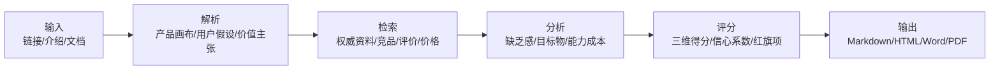
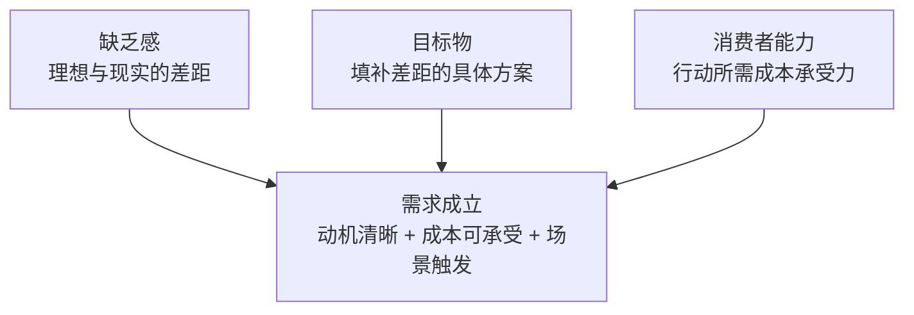

# AI 会议纪要工具需求评估报告

- 产品：AI 会议纪要工具
- 日期：2026-06-09
- 目标市场：中国与海外通用的知识工作团队
- 分析目标：上市前需求评审
- 来源边界：这是用于验证 skill 输出结构的样例报告。证据主要来自用户输入与模型假设，不代表真实产品调研结论。

## 执行摘要

AI 会议纪要工具的缺乏感较强，但需求能否成立主要取决于隐私合规、会议软件集成和准确率信任能否被快速证明。

| 项目 | 结果 |
| --- | --- |
| 建议决策 | 先补验证 |
| 总分 | 5.0 |
| 缺乏感 | 7.2 |
| 目标物 | 6.9 |
| 消费者能力 | 5.6 |
| 证据信心 | 0.76 |
| 最大机会 | 高会议密度团队普遍存在会后信息丢失、行动项不清和复盘成本高的问题。 |
| 最大风险 | 如果隐私、准确率和组织审批证据不足，用户会停留在试用或个人使用阶段。 |

## 可视化诊断

以下图表模块用于快速定位需求强弱、短板、证据质量、采用阻力和下一步优先级。Markdown 版本提供图表等价表格，HTML/PDF 会渲染为静态 SVG 图表。

### 总分诊断：需求可疑但值得验证

- 图表类型：`score_gauge`
- 置信度 0.76 | S1 S2
- 解读：总分处在脆弱到可验证的交界，说明这个方向有真实场景，但证据和采用能力还不足以支撑规模投入。
- 建议：先把验证目标放在企业信任、准确率和集成，而不是直接扩大投放。

| 分组 | 指标/情景 | 数值/X | Y/说明 |
| --- | --- | --- | --- |
|  | 需求总分 | 5.0 | 先补验证 |

### 需求三角雷达：消费者能力拖后腿

- 图表类型：`radar`
- 置信度 0.78 | S1 S2
- 解读：缺乏感和目标物并不弱，真正限制需求成立的是用户能不能放心买、顺利用、长期留。
- 建议：把短期迭代重心放在降低信任成本和组织采用成本。

| 分组 | 指标/情景 | 数值/X | Y/说明 |
| --- | --- | --- | --- |
|  | 缺乏感 | 7.2 |  |
|  | 目标物 | 6.9 |  |
|  | 消费者能力 | 5.6 |  |

### 三大维度短板：能力成本最需要修

- 图表类型：`bar`
- 置信度 0.78 | S1 S2
- 解读：短板不在用户是否有会议纪要问题，而在采用这类工具带来的隐私、审批、准确率和流程改变成本。
- 建议：先证明工具能安全进入现有会议和任务流程，再讨论规模化增长。

| 分组 | 指标/情景 | 数值/X | Y/说明 |
| --- | --- | --- | --- |
|  | 缺乏感 | 7.2 |  |
|  | 目标物 | 6.9 |  |
|  | 消费者能力 | 5.6 |  |

### 子项热力图：信任与风险成本是红区

- 图表类型：`heatmap`
- 置信度 0.74 | S1 S2
- 解读：低分集中在证明、信任成本和风险成本，说明产品不是概念难懂，而是用户不敢把会议资产交给它。
- 建议：把安全、权限、准确率边界和失败回退写成产品核心卖点，而不是附录材料。

| 分组 | 指标/情景 | 数值/X | Y/说明 |
| --- | --- | --- | --- |
| 缺乏感 | 强度 | 8.0 |  |
| 缺乏感 | 频率 | 8.0 |  |
| 缺乏感 | 紧迫性 | 7.0 |  |
| 缺乏感 | 认知 | 7.0 |  |
| 缺乏感 | 趋势 | 7.0 |  |
| 缺乏感 | 付费意愿 | 6.0 |  |
| 目标物 | JTBD匹配 | 8.0 |  |
| 目标物 | 清晰度 | 8.0 |  |
| 目标物 | 差异化 | 6.0 |  |
| 目标物 | 证明 | 5.0 |  |
| 目标物 | 品类认知 | 7.0 |  |
| 目标物 | 见效速度 | 7.0 |  |
| 消费者能力 | 价格 | 6.0 |  |
| 消费者能力 | 行动成本 | 6.0 |  |
| 消费者能力 | 学习成本 | 7.0 |  |
| 消费者能力 | 信任成本 | 4.0 |  |
| 消费者能力 | 风险成本 | 4.0 |  |
| 消费者能力 | 身份成本 | 7.0 |  |
| 消费者能力 | 可获得性 | 6.0 |  |

### 缺乏感细分：高频痛点存在

- 图表类型：`radar`
- 置信度 0.72 | S1
- 解读：会议后整理和行动项遗漏是高频问题，但付费意愿仍需要真实价格和竞品转化数据校准。
- 建议：用访谈和落地页验证用户是否愿意为行动项同步而不是单纯纪要付费。

| 分组 | 指标/情景 | 数值/X | Y/说明 |
| --- | --- | --- | --- |
|  | 强度 | 8.0 |  |
|  | 频率 | 8.0 |  |
|  | 紧迫性 | 7.0 |  |
|  | 认知 | 7.0 |  |
|  | 趋势 | 7.0 |  |
|  | 付费意愿 | 6.0 |  |

### 目标物细分：价值清晰但证明不足

- 图表类型：`radar`
- 置信度 0.73 | S1 S2
- 解读：产品能被一句话理解，但缺少能压过会议软件自带能力和通用 AI 的证明材料。
- 建议：把演示重点从“自动生成摘要”改成“准确识别责任人、截止时间和 CRM/任务同步”。

| 分组 | 指标/情景 | 数值/X | Y/说明 |
| --- | --- | --- | --- |
|  | JTBD匹配 | 8.0 |  |
|  | 清晰度 | 8.0 |  |
|  | 差异化 | 6.0 |  |
|  | 证明 | 5.0 |  |
|  | 品类认知 | 7.0 |  |
|  | 见效速度 | 7.0 |  |

### 消费者能力细分：信任成本最低

- 图表类型：`radar`
- 置信度 0.74 | S1
- 解读：用户学习这个工具并不难，难点是组织是否允许录音、保存、转写和同步敏感会议内容。
- 建议：先做企业级权限、数据保留、删除机制和安全说明，再做团队扩张。

| 分组 | 指标/情景 | 数值/X | Y/说明 |
| --- | --- | --- | --- |
|  | 价格 | 6.0 |  |
|  | 行动成本 | 6.0 |  |
|  | 学习成本 | 7.0 |  |
|  | 信任成本 | 4.0 |  |
|  | 风险成本 | 4.0 |  |
|  | 身份成本 | 7.0 |  |
|  | 可获得性 | 6.0 |  |

### 用户分群机会矩阵：先打销售团队

- 图表类型：`matrix`
- 置信度 0.70 | S1
- 解读：销售团队的会议结果和客户承诺更直接关联收入，缺乏强度更高，也更容易形成 ROI 叙事。
- 建议：首轮验证聚焦销售主管或 RevOps，而不是泛泛面向所有知识工作者。

| 分组 | 指标/情景 | 数值/X | Y/说明 |
| --- | --- | --- | --- |
|  | 高会议密度销售团队 | 6.4 | 8.1 |
|  | 产品与项目负责人 | 5.8 | 7.4 |
|  | 管理运营团队 | 5.2 | 6.8 |

### 竞品与替代方案定位：差异化必须避开泛摘要

- 图表类型：`matrix`
- 置信度 0.68 | S2
- 解读：如果只讲摘要和转写，会议软件和通用 AI 的采用成本更低；只有业务闭环能力能形成差异化。
- 建议：把 CRM、任务系统和客户跟进闭环作为定位核心。

| 分组 | 指标/情景 | 数值/X | Y/说明 |
| --- | --- | --- | --- |
|  | AI会议纪要工具 | 7.2 | 5.6 |
|  | 人工纪要 | 6.5 | 4.2 |
|  | 会议软件转写 | 5.2 | 7.3 |
|  | 通用文档AI | 4.8 | 6.8 |
|  | 不购买 | 2.5 | 9.0 |

### 采用阻力漏斗：团队采购前流失最大

- 图表类型：`funnel`
- 置信度 0.62 | S1
- 解读：漏斗假设显示最大掉点发生在真实会议上传和团队采购之间，核心原因是信任与组织审批。
- 建议：验证时必须记录从个人试用到团队审批的转化阻力。

| 分组 | 指标/情景 | 数值/X | Y/说明 |
| --- | --- | --- | --- |
|  | 知道问题 | 100.0 |  |
|  | 愿意试用 | 64.0 |  |
|  | 上传真实会议 | 46.0 |  |
|  | 团队协作使用 | 30.0 |  |
|  | 进入采购审批 | 18.0 |  |
|  | 持续续费 | 12.0 |  |

### 证据质量分布：样例仍偏假设

- 图表类型：`stacked_bar`
- 置信度 0.76 | S1 S2
- 解读：当前样例只有用户材料和假设，缺少第三方评论、真实竞品页、价格和转化证据。
- 建议：正式报告必须补充真实来源，否则结论应定位为验证计划。

| 分组 | 指标/情景 | 数值/X | Y/说明 |
| --- | --- | --- | --- |
|  | A级用户输入 | 1 |  |
|  | B级第三方证据 | 0 |  |
|  | C级假设 | 1 |  |

### 风险矩阵：隐私与证据风险最高

- 图表类型：`matrix`
- 置信度 0.74 | S1 S2
- 解读：隐私合规和证据不足会直接阻断团队采用，而不是普通产品优化问题。
- 建议：把风险治理作为需求成立的前置条件。

| 分组 | 指标/情景 | 数值/X | Y/说明 |
| --- | --- | --- | --- |
|  | 证据不足 | 8.0 | 8.0 |
|  | 隐私合规 | 7.0 | 9.0 |
|  | 集成不稳定 | 6.0 | 6.0 |
|  | 准确率误伤 | 6.0 | 7.0 |

### 建议优先级矩阵：先做信任材料和验证访谈

- 图表类型：`matrix`
- 置信度 0.71 | S1 S2
- 解读：低成本高增益的动作是访谈和信任材料；深度集成价值高但不适合一开始重投入。
- 建议：先做安全白皮书、行动项 Demo 和目标客户访谈，再决定是否做深集成。

| 分组 | 指标/情景 | 数值/X | Y/说明 |
| --- | --- | --- | --- |
|  | 安全白皮书 | 5.0 | 8.0 |
|  | 行动项Demo | 5.0 | 7.0 |
|  | 10-15个访谈 | 3.0 | 7.0 |
|  | 深度CRM集成 | 8.0 | 8.0 |

### 预测情景：修复短板后才可能进入可扩张区

- 图表类型：`forecast`
- 置信度 0.70 | S1 S2
- 解读：如果不修复信任与证明短板，需求总分大概率停留在验证边缘；完成强证据验证后才可能进入可扩张区。
- 建议：用 90 天作为复盘窗口，先验证企业信任和高会议密度销售团队的付费意愿。

| 分组 | 指标/情景 | 数值/X | Y/说明 |
| --- | --- | --- | --- |
|  | 不处理短板 | 5.0 | low |
|  | 修复信任和合规 | 6.6 | medium |
|  | 完成强证据验证 | 7.4 | medium-high |

## 产品概览

**产品定义：** 面向销售、咨询、产品和管理团队的 AI 会议录音、转写、纪要生成和行动项同步工具。

**价值主张：** 把分散的会议内容转成可追踪的纪要、决策和任务，减少会后整理与遗漏。

**核心功能：**

- 会议录音和自动转写
- 自动生成纪要、决策和行动项
- 与日历、会议软件和任务系统同步
- 支持按项目或客户归档历史会议

**定价与商业模式：**

- 样例假设：个人免费试用，团队按席位订阅
- 样例假设：企业版增加数据保留、权限和合规能力
- SaaS 订阅，可能叠加企业合规和集成服务。

**假设：**

- 样例没有真实官网、价格页或用户评论输入，因此所有市场事实均需后续联网验证。
- 目标市场默认有线上会议和任务协作工具使用习惯。

## 研究方法与来源

这是用于验证 skill 输出结构的样例报告。证据主要来自用户输入与模型假设，不代表真实产品调研结论。

| 来源 | 等级 | 类型 | 标题 | 链接 | 日期 |
| --- | --- | --- | --- | --- | --- |
| S1 | A | user_material | 样例产品输入与需求场景假设 |  | 2026-06-09 |
| S2 | C | assumption | 样例竞品与替代方案假设 |  | 2026-06-09 |

## 目标用户与 JTBD

| 分群 | 场景 | JTBD | 当前替代 | 采用阻碍 |
| --- | --- | --- | --- | --- |
| 高会议密度销售团队 | 每天多场客户会议，需要在会后及时同步承诺事项和下一步动作。 | 减少会后整理时间，并避免客户承诺或跟进动作遗漏。 | 人工手记；CRM 备注；会议录音回听；会后群消息追踪 | 客户隐私和录音授权；CRM 集成成本；转写准确率和行动项识别可信度 |
| 产品与项目负责人 | 跨团队例会后需要把决策、问题和责任人同步到项目管理系统。 | 把会议讨论转成可追踪项目状态，减少重复沟通。 | 人工纪要；项目管理工具评论；共享文档；即时通讯群总结 | 会议上下文复杂导致 AI 摘要误判；团队成员不愿改变会议后流程；与现有项目管理工具同步不稳定 |

## 竞品与替代方案

| 名称 | 类型 | 定位 | 优势 | 弱点 | 来源 |
| --- | --- | --- | --- | --- | --- |
| 人工纪要 | manual | 低工具成本但高时间成本的默认替代方案。 | 上下文理解强；无需采购审批 | 耗时；标准不稳定；容易遗漏 | S1 |
| 会议软件自带转写 | substitute | 嵌入现有会议工具的基础转写能力。 | 入口自然；部署成本低 | 行动项和业务系统同步可能不足；跨工具归档能力有限 | S2 |
| 通用文档 AI 助手 | indirect | 把会议材料粘贴后生成总结。 | 灵活；学习成本低 | 需要人工搬运材料；缺少实时录音和系统集成 | S2 |

## 需求三角分析

### 缺乏感：7.2

**推理：** 会议纪要和行动项追踪属于高频工作流，问题强度和发生频率都较高，但真实愿付意愿需要价格页、竞品和访谈证据补充。

**支持证据：**

- 高会议密度岗位有持续整理、同步和追踪压力，这是样例输入中的核心场景 [S1]。
- 销售、咨询和项目团队的会后动作遗漏会直接影响客户承诺、项目进度和内部协作 [S1]。

**反证或缺口：**

- 样例没有真实用户评论或搜索数据，缺乏感强度仍需验证。
- 部分团队可能已经通过 CRM、共享文档或会议软件功能解决主要问题。

**改进路径：** 先访谈高会议密度销售与项目团队，量化每周整理时间、遗漏成本和已付费替代方案。

### 目标物：6.9

**推理：** 目标物与用户任务匹配较好，品类认知也相对成熟；短板在于差异化和证据强度，需要证明它不只是转写或摘要工具。

**支持证据：**

- 自动转写、纪要、行动项和同步直接对应会后整理 JTBD [S1]。
- 目标物可以用一句话解释：把会议变成可追踪的决策和任务 [S1]。

**反证或缺口：**

- 会议软件自带转写和通用文档 AI 可能削弱差异化 [S2]。
- 样例缺少真实演示、准确率数据、客户案例或第三方评价。

**改进路径：** 用真实会议样本展示行动项识别、业务系统同步和错误纠正能力，并与会议软件自带能力对比。

### 消费者能力：5.6

**推理：** 学习成本不高，但信任、隐私、安全和审批成本明显偏高。这是样例产品的短板维度。

**支持证据：**

- 如果产品能接入现有日历、会议和任务系统，行动成本可以下降 [S1]。
- 团队版订阅和企业版合规能力是可能的商业路径 [S1]。

**反证或缺口：**

- 录音授权、隐私合规和数据保留策略可能成为组织采用门槛。
- 准确率不足会造成错误纪要和错误行动项，直接提高信任成本。
- 企业客户可能需要采购、法务和安全审批。

**改进路径：** 优先补充权限、数据保留、隐私政策、企业安全说明、准确率边界和人工校对机制。

## 评分与解释

| 维度 | 分数 |
| --- | --- |
| 缺乏感 | 7.2 |
| 目标物 | 6.9 |
| 消费者能力 | 5.6 |
| 证据信心 | 0.76 |
| 总分 | 5.0 |

## 建议与实验

| 优先级 | 领域 | 建议 | 理由 | 预期影响 | 成本 |
| --- | --- | --- | --- | --- | --- |
| P0 | trust | 先建立隐私、授权、数据保留和安全白皮书，再扩大企业销售。 | 消费者能力短板集中在信任和风险成本。 | 降低组织审批阻力，提高团队版转化。 | medium |
| P1 | product | 把产品演示聚焦在行动项识别和业务系统同步，而不是泛泛摘要。 | 差异化短板来自会议软件和通用 AI 的替代压力。 | 提升目标物清晰度和差异化。 | medium |
| P1 | research | 补做 10-15 个高会议密度团队访谈，量化整理时间、遗漏成本和当前替代方案。 | 样例缺少真实用户反馈证据。 | 提高证据信心并校准缺乏感评分。 | low |

| 假设 | 分群 | 方法 | 指标 | 阈值 | 决策规则 |
| --- | --- | --- | --- | --- | --- |
| 高会议密度销售团队愿意为自动行动项同步付费。 | 高会议密度销售团队 | 落地页 + 真实会议 Demo + 预约试用 | 预约试用转化率 | 目标客群访客转化率超过 8% | 低于阈值则重写价值主张或切换细分场景。 |
| 隐私和准确率说明能显著降低企业试用阻力。 | 产品与项目负责人 | A/B 测试普通 Demo 与合规/准确率增强 Demo | 企业试用申请率 | 增强 Demo 申请率提升 30% | 若无提升，说明阻力可能来自集成或流程改变，而非信任材料。 |

## 风险与伦理

| 严重度 | 类型 | 风险 | 缓释 | 来源 |
| --- | --- | --- | --- | --- |
| high | evidence | 样例报告缺少真实官网、用户评论、竞品价格和第三方评价。 | 正式报告必须联网检索并补充来源等级。 | S1 |
| high | privacy | 会议录音与转写可能包含客户隐私、商业秘密或个人信息。 | 提供授权流程、数据保留策略、权限控制和删除机制。 | S1 |
| medium | execution | 与会议软件、CRM 或任务系统集成不稳定会提高行动成本。 | 先支持最常见工具链，并提供失败回退和手动校对。 | S2 |

## 预测情景

- 预测窗口：90 days
- 置信度：0.7
- 复盘触发：如果 10 个目标客户访谈中少于 3 个愿意试用，或增强 Demo 没有提升企业试用申请率，需要重新判断缺乏感和目标物。

| 情景 | 预测分数 | 采用可能性 | 关键假设 |
| --- | --- | --- | --- |
| 不处理短板 | 5.0 | low | 继续只强调自动摘要和转写。；没有新增安全、准确率和组织审批证据。 |
| 修复信任和合规短板 | 6.6 | medium | 补充权限、数据保留、安全说明和授权流程。；完成真实会议 Demo 并展示行动项准确率边界。 |
| 完成强证据验证 | 7.4 | medium-high | 10-15 个目标客户访谈中至少 5 个愿意试用。；落地页目标客群试用转化率超过 8%。；增强 Demo 显著提升企业试用申请率。 |

## 最终方案

**最终判断：** 这是一个有真实场景但尚未证明组织采用能力的需求方向，当前不宜直接规模化，应先补验证和信任短板。

**总体策略：** 聚焦高会议密度销售团队，把产品从泛纪要工具收窄为客户会议行动项闭环工具，用安全信任材料和真实 Demo 证明可被组织采用。

### 未来 30 天

- 完成 10-15 个高会议密度销售团队访谈。
- 制作行动项识别、责任人、截止时间和 CRM/任务同步 Demo。
- 补齐隐私、授权、数据保留、删除机制和安全说明。

### 未来 60 天

- 用落地页和 Demo 验证预约试用转化率。
- 对比普通摘要定位和行动项闭环定位的转化差异。
- 选择一个主流工具链完成轻量集成验证。

### 未来 90 天

- 复盘企业试用申请率、会议上传率和团队协作使用率。
- 根据真实使用数据重算需求三角分数。
- 若进入 6.8 分以上区间，再评估渠道和销售扩张。

### 决策规则

- 如果目标客群访客预约试用转化率超过 8%，继续推进团队版验证。
- 如果增强 Demo 不能提升企业试用申请率，优先重查采用阻力。
- 如果访谈中付费意愿低于 30%，重新定位目标用户或暂停规模投入。

## 附录

### 未解问题

- 目标客户当前每周花多少时间整理会议纪要？
- 客户愿意为自动行动项同步支付多少费用？
- 隐私合规、准确率和集成能力中哪个最影响试用转化？
