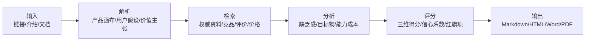
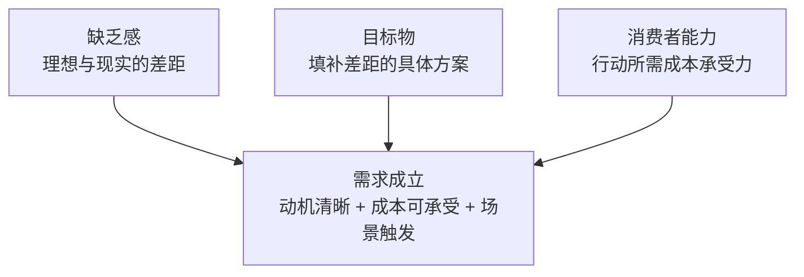

# 蔚来 ES8 需求诊断报告

- 产品：蔚来全新 ES8
- 日期：2026-06-12
- 目标市场：中国高端大型三排 SUV 市场
- 分析目标：真实产品需求诊断与增长短板识别
- 来源边界：公开资料检索至 2026-06-12。优先采用蔚来官方、IR/财报、官方竞品页面和近期行业媒体；车主口碑类来源只作为定性线索，不等同于全量用户调研。

## 执行摘要

全新 ES8 已经证明高端大型三排纯电 SUV 存在强需求，真正限制它从爆发走向长期稳态的不是目标物本身，而是用户对真实续航、冬季/高速能耗、满载储物、质量细节和竞品替代的能力成本判断。

| 项目 | 结果 |
| --- | --- |
| 建议决策 | 先修短板 |
| 总分 | 7.4 |
| 缺乏感 | 8.3 |
| 目标物 | 8.5 |
| 消费者能力 | 7.4 |
| 证据信心 | 0.88 |
| 最大机会 | 大型三排纯电 SUV 正在从边缘尝试进入高端家庭主车选择，ES8 借助换电、BaaS、服务体系和 100000 台级别交付验证占据先发位置。 |
| 最大风险 | 新车热度、竞品挤压和真实用车不确定性可能让用户从“喜欢这台车”退回到“再等等、再比较、再看口碑”。 |

## 可视化诊断

以下图表模块用于快速定位需求强弱、短板、证据质量、采用阻力和下一步优先级。Markdown 版本提供图表等价表格，HTML/PDF 会渲染为静态 SVG 图表。

### 总分诊断：强需求已成立，先修短板再放大

- 图表类型：`score_gauge`
- 置信度 0.88 | S4 S5 S6 S8
- 解读：总分进入较强区间，说明 ES8 不是概念型需求，而是已经被交付和销量验证的真实需求。
- 建议：增长节奏上不宜只加大投放，应把冬季/高速续航、满载体验和交付口碑作为下一轮放大的前置条件。

| 分组 | 指标/情景 | 数值/X | Y/说明 |
| --- | --- | --- | --- |
|  | 需求总分 | 7.4 | 修短板后放大 |

### 需求三角雷达：消费者能力是相对短板

- 图表类型：`radar`
- 置信度 0.88 | S1 S2 S5 S13 S14
- 解读：缺乏感与目标物都很强，说明市场问题和解决方案匹配度较高；能力维度低于另外两维。
- 建议：把营销重点从“旗舰配置”转向“用户能否放心买、放心用、长期不后悔”。

| 分组 | 指标/情景 | 数值/X | Y/说明 |
| --- | --- | --- | --- |
|  | 缺乏感 | 8.3 |  |
|  | 目标物 | 8.5 |  |
|  | 消费者能力 | 7.4 |  |

### 三大维度短板：能力成本最需要修

- 图表类型：`bar`
- 置信度 0.86 | S13 S14
- 解读：能力维度没有低到否定需求，但会决定高峰销量能否转化为长期稳定销量。
- 建议：优先降低能力成本，而不是继续堆叠配置卖点。

| 分组 | 指标/情景 | 数值/X | Y/说明 |
| --- | --- | --- | --- |
|  | 缺乏感 | 8.3 |  |
|  | 目标物 | 8.5 |  |
|  | 消费者能力 | 7.4 |  |

### 子项热力图：风险成本与行动成本是红区

- 图表类型：`heatmap`
- 置信度 0.84 | S1 S7 S13 S14
- 解读：目标物相关子项整体偏高，消费者能力里的行动成本与风险成本明显偏低。
- 建议：用更透明的用车成本、续航边界、交付周期和售后 SLA 来降低犹豫。

| 分组 | 指标/情景 | 数值/X | Y/说明 |
| --- | --- | --- | --- |
| 缺乏感 | 强度 | 8.5 |  |
| 缺乏感 | 频率 | 7.8 |  |
| 缺乏感 | 紧迫 | 7.0 |  |
| 缺乏感 | 显性 | 8.8 |  |
| 缺乏感 | 趋势 | 9.0 |  |
| 缺乏感 | 支付 | 8.5 |  |
| 目标物 | 匹配 | 8.7 |  |
| 目标物 | 清晰 | 8.2 |  |
| 目标物 | 差异 | 8.6 |  |
| 目标物 | 证明 | 8.9 |  |
| 目标物 | 品类 | 8.4 |  |
| 目标物 | 见效 | 8.0 |  |
| 消费者能力 | 价格 | 7.0 |  |
| 消费者能力 | 行动 | 6.8 |  |
| 消费者能力 | 学习 | 7.6 |  |
| 消费者能力 | 信任 | 8.0 |  |
| 消费者能力 | 风险 | 6.7 |  |
| 消费者能力 | 形象 | 8.4 |  |
| 消费者能力 | 可得 | 7.8 |  |

### 缺乏感细分：趋势与支付意愿最强

- 图表类型：`radar`
- 置信度 0.86 | S5 S8 S10
- 解读：市场正在从“纯电大三排能不能卖”转向“谁能稳定吃下这个价格带”。
- 建议：抓住纯电大型三排的品类窗口，但避免把短期换代热度误判为永久领先。

| 分组 | 指标/情景 | 数值/X | Y/说明 |
| --- | --- | --- | --- |
|  | 痛感强度 | 8.5 |  |
|  | 使用频率 | 7.8 |  |
|  | 替换紧迫 | 7.0 |  |
|  | 问题显性 | 8.8 |  |
|  | 趋势推力 | 9.0 |  |
|  | 支付意愿 | 8.5 |  |

### 目标物细分：换电与大三排形成强识别

- 图表类型：`radar`
- 置信度 0.87 | S1 S2 S3 S12
- 解读：ES8 的强项不是单点配置，而是把空间、服务、补能和价格方案组合成一个可理解的旗舰答案。
- 建议：保持“大三排纯电旗舰 + 换电体系”的主叙事，不要让传播被零散配置稀释。

| 分组 | 指标/情景 | 数值/X | Y/说明 |
| --- | --- | --- | --- |
|  | 任务匹配 | 8.7 |  |
|  | 认知清晰 | 8.2 |  |
|  | 差异化 | 8.6 |  |
|  | 证据强度 | 8.9 |  |
|  | 品类契合 | 8.4 |  |
|  | 价值显现 | 8.0 |  |

### 消费者能力细分：风险成本拖后腿

- 图表类型：`radar`
- 置信度 0.82 | S7 S13 S14
- 解读：目标用户买得起，但不代表愿意承担不确定性；风险成本比价格本身更影响犹豫。
- 建议：用真实车主长期样本和场景化保障政策替代抽象承诺。

| 分组 | 指标/情景 | 数值/X | Y/说明 |
| --- | --- | --- | --- |
|  | 金钱成本 | 7.0 |  |
|  | 行动成本 | 6.8 |  |
|  | 学习成本 | 7.6 |  |
|  | 信任成本 | 8.0 |  |
|  | 风险成本 | 6.7 |  |
|  | 形象成本 | 8.4 |  |
|  | 可获得性 | 7.8 |  |

### 人群机会矩阵：老用户与高端家庭最优先

- 图表类型：`matrix`
- 置信度 0.78 | S1 S5 S8 S13
- 解读：高端多孩家庭需求最强，蔚来老用户转化成本最低；长途自驾家庭需求强但补能和续航证明要求更高。
- 建议：先吃透老用户与高端家庭，再用长途案例和换电网络证明去扩展犹豫人群。

| 分组 | 指标/情景 | 数值/X | Y/说明 |
| --- | --- | --- | --- |
|  | 蔚来老用户 | 8.4 | 7.9 |
|  | 高端多孩家庭 | 7.8 | 8.7 |
|  | 商务兼家庭 | 7.4 | 8.2 |
|  | 长途自驾家庭 | 6.5 | 8.1 |
|  | 传统豪华换购 | 6.9 | 7.5 |

### 竞品定位：ES8 赢在纯电补能与服务闭环

- 图表类型：`matrix`
- 置信度 0.78 | S15 S16 S17 S18
- 解读：ES8 的位置接近第一梯队，但理想和问界用增程/华为生态降低不确定性，特斯拉用价格效率形成下压。
- 建议：不要只和传统豪华比配置，应正面回应增程无焦虑和华为智舱智驾的替代理由。

| 分组 | 指标/情景 | 数值/X | Y/说明 |
| --- | --- | --- | --- |
|  | 蔚来 ES8 | 8.2 | 8.5 |
|  | 理想 L9 | 8.6 | 8.3 |
|  | 问界 M9 | 8.4 | 8.4 |
|  | Model Y L | 7.5 | 6.8 |
|  | 宝马 X5 | 7.0 | 7.2 |

### 转化漏斗：从试驾到交付的损耗在决策链条

- 图表类型：`funnel`
- 置信度 0.72 | S3 S5 S13
- 解读：高价家庭车的损耗不是单点发生，而是家庭成员共识、预算计算、配置选择和等待体验共同造成。
- 建议：门店和销售流程要围绕家庭共识与长期用车成本设计，而不是只做个人试驾体验。

| 分组 | 指标/情景 | 数值/X | Y/说明 |
| --- | --- | --- | --- |
|  | 认知 | 100.0 |  |
|  | 到店/试驾 | 72.0 |  |
|  | 锁单 | 50.0 |  |
|  | 等待交付 | 43.0 |  |
|  | 满意使用 | 37.0 |  |
|  | 推荐复购 | 30.0 |  |

### 证据结构：官方与交付数据强，口碑仍需长期样本

- 图表类型：`stacked_bar`
- 置信度 0.83 | S1 S4 S5 S6 S13 S14
- 解读：产品与交付证据很强，但长期留存、冬季真实体验和质量稳定性仍需要更多公开样本。
- 建议：建立按季更新的车主体验证据库，特别关注 6-12 个月后的满意度与推荐率。

| 分组 | 指标/情景 | 数值/X | Y/说明 |
| --- | --- | --- | --- |
|  | 产品事实 | 8 |  |
|  | 市场销量 | 9 |  |
|  | 竞品信息 | 6 |  |
|  | 用户口碑 | 4 |  |
|  | 长期留存 | 2 |  |

### 风险矩阵：竞品挤压与真实续航最关键

- 图表类型：`matrix`
- 置信度 0.80 | S13 S14 S15 S16 S17
- 解读：最高风险来自“用户预期与真实长期体验不一致”，其次是强竞品持续把选择成本拉高。
- 建议：把风险最高的场景做成可验证承诺：冬季高速续航、换电覆盖、满载储物和软件稳定性。

| 分组 | 指标/情景 | 数值/X | Y/说明 |
| --- | --- | --- | --- |
|  | 冬季高速续航 | 7.8 | 8.2 |
|  | 竞品挤压 | 8.0 | 8.0 |
|  | 新车热度回落 | 6.8 | 7.2 |
|  | 软件/品控波动 | 6.4 | 6.8 |
|  | 交付等待 | 5.8 | 6.4 |
|  | BaaS理解偏差 | 5.5 | 6.2 |

### 行动优先级：先补能力成本，再放大声量

- 图表类型：`bar`
- 置信度 0.82 | S13 S14
- 解读：这些行动都不只是传播动作，而是在降低用户真实购买门槛。
- 建议：优先做能够让用户和家人共同决策的证据型内容与销售工具。

| 分组 | 指标/情景 | 数值/X | Y/说明 |
| --- | --- | --- | --- |
|  | 冬季/高速证据 | 9.2 |  |
|  | 满载家庭场景 | 8.6 |  |
|  | 交付透明度 | 8.1 |  |
|  | BaaS成本教育 | 7.8 |  |
|  | 智舱智驾稳定 | 7.6 |  |
|  | 竞品对比工具 | 7.4 |  |

### 12 个月预测：基准情形仍可维持强需求

- 图表类型：`forecast`
- 置信度 0.76 | S5 S6 S8 S10
- 解读：除非出现质量或竞争重大负面，ES8 的需求基础不会突然消失；差别在于它能否从爆款变成稳定旗舰。
- 建议：把 2026 年下半年的核心指标从交付量扩展到订单取消率、交付满意度、冬季投诉率和老带新率。

| 分组 | 指标/情景 | 数值/X | Y/说明 |
| --- | --- | --- | --- |
|  | 保守 | 6.7 | medium |
|  | 基准 | 7.5 | medium-high |
|  | 乐观 | 8.2 | high |

## 产品概览

**产品定义：** 面向高净值家庭、商务兼家庭用户和蔚来体系用户的旗舰级纯电大型三排 SUV，通过大空间、舒适座舱、换电补能、BaaS 降低入门门槛与高端服务体系来承接家庭出行与商务接待需求。

**价值主张：** 在 6-7 人真实乘坐场景下，用纯电旗舰体验、换电补能和蔚来服务同时解决空间、体面、安全和补能焦虑。

**核心功能：**

- 5280mm 车长、3130mm 轴距的大型三排空间
- 6 座与 7 座版本，强调第二排与第三排舒适性
- 102kWh/100kWh 级电池、900V 高压平台、CLTC 约 635km 的旗舰纯电能力
- 双电机四驱，公开报道 0-100km/h 约 3.97 秒
- NIO Power 换电和充电网络，BaaS 方案降低购车起点
- NT.Cedar 智能系统、智能座舱和辅助驾驶能力
- 高强度车身、11 安全气囊和旗舰级被动安全配置

**定价与商业模式：**

- 官方上市起售价约 40.68 万元，BaaS 起点约 29.88 万元；签名版约 44.68 万元，BaaS 起点约 33.88 万元。
- 电池租用月费公开报道约 1128 元/月，实际以蔚来当期政策为准。
- 整车销售 + BaaS 电池租用 + 换电/充电/服务生态 + 高端用户运营。

**假设：**

- 本报告聚焦中国市场的全新 ES8，不把欧洲小规模市场表现作为主要依据。
- 销量、交付、基础设施等公开披露数据存在口径差异，评分以趋势和相对确定性为主。
- 车主口碑类来源代表公开样本，不等同于全量用户调研。

## 研究方法与来源

公开资料检索至 2026-06-12。优先采用蔚来官方、IR/财报、官方竞品页面和近期行业媒体；车主口碑类来源只作为定性线索，不等同于全量用户调研。

| 来源 | 等级 | 类型 | 标题 | 链接 | 日期 |
| --- | --- | --- | --- | --- | --- |
| S1 | A | official_product_page | NIO ES8 官方产品页 | https://www.nio.com/es8 | 2026-06-12 |
| S2 | A | official_news | NIO All-New ES8 Pre-order Announcement | https://www.nio.com/news/20250821001 | 2026-06-12 |
| S3 | A | official_news | NIO Day 2025 All-New ES8 Launch | https://www.nio.com/news/20250920001 | 2026-06-12 |
| S4 | A | investor_relations | NIO September and Q3 2025 Delivery Update | https://ir.nio.com/news-releases/news-release-details/nio-inc-provides-september-and-third-quarter-2025-delivery/ | 2026-06-12 |
| S5 | A | investor_relations | NIO April 2026 Delivery Update | https://ir.nio.com/zh-hant/news-releases/news-release-details/nio-inc-provides-april-2026-delivery-update/ | 2026-06-12 |
| S6 | B | press_release_mirror | NIO May 2026 Delivery Update | https://www.stocktitan.net/news/NIO/nio-inc-provides-may-2026-delivery-o4v1jhbondmw.html | 2026-06-12 |
| S7 | A | financial_results | NIO Q1 2026 Financial Results | https://www.globenewswire.com/news-release/2026/05/21/3299109/0/en/nio-inc-reports-unaudited-first-quarter-2026-financial-results.html | 2026-06-12 |
| S8 | B | industry_media | NIO new ES8 expected to reach 120000th delivery this month | https://cnevpost.com/2026/06/05/nio-new-es8-to-reach-120000th-delivery-this-month/ | 2026-06-12 |
| S9 | B | industry_media | Nio launches 3rd-gen ES8 SUV | https://cnevpost.com/2025/09/20/nio-launches-3rd-gen-es8/ | 2026-06-12 |
| S10 | B | industry_media | 大型三排 SUV 市场结构变化报道 | https://auto.ifeng.com/c/8tGKsZmZf1R | 2026-06-12 |
| S11 | C | industry_media | 全新 ES8 110000 台交付报道 | https://auto.news18a.com/news/storys_258835.html | 2026-06-12 |
| S12 | A | official_product_page | NIO Power 官方页面 | https://www.nio.cn/nio-power | 2026-06-12 |
| S13 | C | user_feedback_media | 全新蔚来 ES8 真实车主口碑评测 | https://k.sina.com.cn/article_7857141524_1d45277140190321lw.html | 2026-06-12 |
| S14 | C | user_feedback_media | 全新蔚来 ES8 用户口碑与痛点分析 | https://chejiahao.autohome.com.cn/info/24743824 | 2026-06-12 |
| S15 | A | competitor_official | 理想 L9 官方页面 | https://www.lixiang.com/L9 | 2026-06-12 |
| S16 | A | competitor_official | 问界 M9 官方页面 | https://hima.auto/wenjie/ | 2026-06-12 |
| S17 | B | industry_media | 特斯拉 Model Y L 上市报道 | https://www.stcn.com/article/detail/3175664.html | 2026-06-12 |
| S18 | C | industry_media | 宝马 X5 中国市场价格报道 | https://auto.news18a.com/ | 2026-06-12 |

## 目标用户与 JTBD

| 分群 | 场景 | JTBD | 当前替代 | 采用阻碍 |
| --- | --- | --- | --- | --- |
| 高端多孩家庭 | 需要 6-7 人同乘、老人孩子舒适上下车、第三排可长期使用，并兼顾安全和体面。 | 买一台可以作为家庭主车的大型 SUV，让全家出行舒服、安全、不焦虑。 | 理想 L9；问界 M9；GLS/X7 等燃油豪华 SUV；MPV | 价格和长期成本；真实续航与冬季高速；满载后储物空间；交付等待 |
| 商务兼家庭用户 | 平时用于商务接待、客户拜访或公司形象展示，周末承担家庭出行。 | 用一台车同时满足体面、舒适、智能和家庭承载，避免商务与家庭两套车辆成本。 | 宝马 X5；奔驰 GLE；问界 M9；理想 L9 | 传统豪华品牌惯性；纯电长途不确定性；智驾和车机稳定性；残值与品牌财务信任 |
| 蔚来老用户与纯电拥护者 | 已经接受换电、服务和社区生态，希望升级到更大的家庭旗舰。 | 在不离开蔚来体系的前提下，从中大型 SUV/轿车升级到真正的大三排主车。 | 蔚来 ES6/ES7/ES9；特斯拉 Model Y L；继续持有现车 | 升级成本；ES9 等内部车型分流；热门配置等待；老车置换残值 |
| 长途重度自驾家庭 | 频繁跨城、自驾游、节假日高速出行，对补能可达性和续航稳定要求极高。 | 获得大三排舒适体验，同时不牺牲长途路线自由度。 | 增程大型 SUV；燃油大型 SUV；混动 MPV | 高速/冬季续航折扣；换电站排队和覆盖；满载能耗；节假日不确定性 |

## 竞品与替代方案

| 名称 | 类型 | 定位 | 优势 | 弱点 | 来源 |
| --- | --- | --- | --- | --- | --- |
| 理想 L9 | direct | 增程式家庭旗舰 SUV，强调家庭空间、舒适和补能无焦虑。 | 增程降低里程焦虑；家庭场景心智强；价格与配置清晰 | 不是纯电旗舰体验；能源形式和品牌调性与纯电用户偏好不同 | S15 |
| 问界 M9 | direct | 鸿蒙智行高端旗舰 SUV，依靠华为生态、智能座舱和智驾心智竞争。 | 华为生态强信任；智能化认知强；增程/纯电路线覆盖不同偏好 | 品牌豪华感仍在重塑；与蔚来服务和换电体验不同 | S16 |
| 特斯拉 Model Y L | direct | 六座纯电 SUV，以品牌效率和更低价格切入家庭纯电需求。 | 价格门槛更低；特斯拉品牌和充电网络认知强；交付效率高 | 豪华感与大三排舒适不如 ES8；家庭旗舰属性较弱 | S17 |
| 宝马 X5 | substitute | 传统豪华中大型 SUV，承接保守高端用户和燃油豪华品牌偏好。 | 豪华品牌心智强；残值和社会认知稳定；燃油补能无学习成本 | 三排和智能化不占优；使用成本和新能源体验不如纯电 | S18 |
| 继续持有现车或购买 MPV | substitute | 用户推迟高价换车，或用 MPV 解决更强家庭承载。 | 现金流压力更低；MPV 的乘坐与储物效率高 | 缺少 SUV 形象与纯电旗舰体验；不能解决换新和智能化诉求 |  |

## 需求三角分析

### 缺乏感：8.3

**推理：** 高端家庭用户对大空间、舒适、安全和低补能焦虑的缺乏感很强；官方交付里程碑与近期销量势能进一步说明这不是小众兴趣。但它的紧迫性低于日常刚需工具，仍受换车周期和竞品发布节奏影响。

**支持证据：**

- 官方与行业资料显示，全新 ES8 定位高端大型三排纯电 SUV，并把空间、舒适、安全和补能作为核心问题来回应 [S1][S2]。
- 2026 年 4 月官方 IR 披露 ES8 在 215 天达成 100000 台交付里程碑，说明高价区间存在真实购买而非单纯关注 [S5]。
- 近期行业报道显示大型三排纯电 SUV 市场正在扩大，ES8 连续月销过万并向 120000 台交付推进 [S8][S10]。

**反证或缺口：**

- 换车属于高金额、低频决策，很多用户会等待竞品、价格政策和长期口碑。
- 大型三排纯电的高速、冬季和满载体验还需要更长周期验证。
- 销量高峰可能受到换代、价格重置和早期订单集中交付影响。

**改进路径：** 把缺乏感从“大车豪华”具体化为多代同乘、满载长途、商务兼家庭和冬季高速等强场景，并持续披露真实用车证据。

### 目标物：8.5

**推理：** ES8 的产品定义清楚，目标物不是单一参数，而是大三排、纯电、换电、BaaS 与服务的组合方案。这个组合足以形成差异化，也已经被交付数据验证。短板在于长期体验必须持续符合 40 万元级旗舰预期。

**支持证据：**

- 官方产品页披露全新 ES8 的大空间、座舱舒适、智能系统和安全配置，直接匹配家庭旗舰 SUV 任务 [S1]。
- 官方上市与预售信息显示，ES8 用 BaaS 降低入门门槛，并把换电和充电网络作为纯电大型车的重要支撑 [S2][S3][S12]。
- 100000 台级别交付、连续月销过万和高端市场排名线索构成了较强目标物验证 [S5][S8]。

**反证或缺口：**

- 理想 L9、问界 M9 和 Model Y L 分别从无焦虑、智能生态和低价效率上削弱 ES8 的独占性。
- BaaS、换电、购车价格和长期成本组合复杂，需要销售端解释。
- 长期价值是否稳定还依赖续航、质量、软件和服务体验持续达标。

**改进路径：** 保持“大三排纯电旗舰 + 换电体系”的主叙事，用真实车主和竞品对比证明它不是配置堆叠，而是完整高端家庭主车方案。

### 消费者能力：7.4

**推理：** 目标用户具备支付能力，且蔚来品牌、服务和换电网络降低了信任成本；但购买行动成本和长期风险成本仍是相对短板。用户不是不知道 ES8 好，而是要确认自己能否放心买、放心用、长期不后悔。

**支持证据：**

- 官方和媒体披露的 BaaS 起点降低了一次性购车门槛，但仍需要用户理解电池租用与长期总成本 [S3][S9]。
- 公开口碑样本普遍认可空间、舒适、换电和服务，但也反复提到真实续航、冬季高速、满载储物、车机/辅助驾驶和品控细节 [S13][S14]。
- 蔚来财报和交付规模增强了品牌信任，但高端家庭车购买仍需要家庭共识、试驾、等待交付和竞品比较 [S7]。

**反证或缺口：**

- 部分地区换电站覆盖和排队体验可能与一线城市不同。
- 高价家庭车的购买链条长，家庭成员意见不一致会拉低转化。
- 竞品降价或新车型发布会提高用户等待与比较成本。

**改进路径：** 优先降低能力成本：用冬季/高速实测、满载场景、BaaS 总成本计算器、交付透明度和质量闭环来减少犹豫。

## 评分与解释

| 维度 | 分数 |
| --- | --- |
| 缺乏感 | 8.3 |
| 目标物 | 8.5 |
| 消费者能力 | 7.4 |
| 证据信心 | 0.88 |
| 总分 | 7.4 |

## 建议与实验

| 优先级 | 领域 | 建议 | 理由 | 预期影响 | 成本 |
| --- | --- | --- | --- | --- | --- |
| P0 | 真实场景证据 | 建立冬季高速、满员长途、节假日换电、家庭露营和商务接待等高不确定场景的真实案例库。 | 这些场景正是用户从喜欢到放心之间的关键障碍。 | 降低续航和补能异议，提高试驾后锁单率。 | medium |
| P0 | BaaS 与长期成本 | 上线买断、BaaS、换电、保险、保值和换车周期的一页式成本计算器。 | ES8 的价格方案降低门槛，但解释成本高。 | 减少家庭决策摩擦和价格异议。 | medium |
| P1 | 家庭满载体验 | 把 6-7 人同乘、儿童座椅、老人上下车、后备厢和前备厢收纳做成标准化演示。 | 高端家庭用户买的是真实家庭主车，不是单人试驾体验。 | 提升家庭用户二次到店和推荐率。 | medium |
| P1 | 竞品对比 | 按补能、空间、长期成本、智能化、服务和品牌风险建立透明竞品对比工具。 | 用户一定会比较理想、问界、特斯拉和传统豪华。 | 降低竞品流失，提高销售端异议处理一致性。 | low |
| P2 | 长期口碑 | 建立 3/6/12 个月车主追踪报告，持续公开质量、能耗、补能、服务和推荐意愿。 | 爆款转稳定旗舰需要长期证据，而不只是上市热度。 | 提高老带新和长期信任。 | high |

| 假设 | 分群 | 方法 | 指标 | 阈值 | 决策规则 |
| --- | --- | --- | --- | --- | --- |
| 如果潜客看到同配置、同载重、同路线的冬季/高速真实续航和换电案例，续航相关犹豫会显著下降。 | 长途重度自驾家庭 | 北方冬季高速、南方湿冷、高速满载三类路线做车主共创实测内容，并在销售流程中随机展示。 | 试驾后锁单率、续航相关异议数量、订单取消率 | 锁单率提升 10% 以上，续航相关异议下降 20% 以上。 | 达标则纳入门店标准销售材料；不达标则重做补能承诺和路线建议。 |
| 把 BaaS 与买断方案做成家庭决策表，可以减少价格疑虑和销售解释成本。 | 高端多孩家庭 | 门店和线上询价页提供 3/5/8 年总成本对比，加入保值、换电、换车周期假设。 | 价格异议处理时长、BaaS 选择率、下订率 | 价格异议处理时长下降 25%，下订率提升 8%。 | 达标则固化为所有销售渠道的第一层解释工具。 |
| 全家共同体验第三排、储物、上下车和长途舒适，会比单人试驾更能推动决策。 | 高端多孩家庭与商务兼家庭用户 | 设计 45 分钟家庭试驾路线，覆盖老人上下车、儿童座椅、后备厢装载和第二/三排切换。 | 家庭试驾后的二次到店率、锁单率、推荐意愿 | 二次到店率提升 15%，锁单率提升 10%。 | 达标则将家庭试驾作为 ES8 核心转化流程。 |

## 风险与伦理

| 严重度 | 类型 | 风险 | 缓释 | 来源 |
| --- | --- | --- | --- | --- |
| high | 产品体验 | 真实续航与冬季高速口碑不稳定，会削弱纯电大三排主车信心。 | 用官方、媒体和车主共同实测形成透明边界，并提供路线补能建议。 | S13 S14 |
| high | 竞争 | 问界、理想、特斯拉或传统豪华降价和新车型发布，抬高用户比较成本。 | 建立动态竞品对比和价格价值锚，不把优势只押在新车热度。 | S15 S16 S17 S18 |
| medium | 交付 | 热门配置交付等待影响用户情绪和订单确定性。 | 对热门配置做清晰等待预期和补偿机制，销售端避免过度承诺。 | S5 S8 |
| medium | 软件与质量 | 车机、辅助驾驶和品控细节损害旗舰感。 | 建立高频问题闭环、OTA 透明节奏和重点车主回访机制。 | S13 S14 |
| medium | 成本认知 | BaaS 总成本理解偏差导致后期不满或决策拖延。 | 把总拥有成本和不同使用年限适用人群讲清楚。 | S3 S9 |

## 预测情景

- 预测窗口：未来 12 个月
- 置信度：0.76
- 复盘触发：如果连续两个季度 ES8 月销低于预期、订单取消率显著上升、冬季/高速口碑负面集中，或问界/理想/特斯拉出现强降价，需要重新计算消费者能力分。

| 情景 | 预测分数 | 采用可能性 | 关键假设 |
| --- | --- | --- | --- |
| 保守 | 6.7 | medium | 竞品降价或新车型分流；真实续航口碑分化；月销回落到高位但不再破圈 |
| 基准 | 7.5 | medium-high | 交付稳定；换电网络继续扩张；ES8 稳住高端纯电大三排第一梯队 |
| 乐观 | 8.2 | high | 冬季/高速体验被证实；服务口碑扩散；持续压制增程竞品心智 |

## 最终方案

**最终判断：** ES8 不是需求不成立，而是强需求进入长期验证期。当前应判定为“修短板后放大”：继续承接高端大三排纯电窗口，但增长动作必须围绕降低能力成本展开。

**总体策略：** 用“真实场景证据链 + BaaS 成本透明 + 家庭满载体验 + 动态竞品对比”把用户从喜欢推进到放心，从短期爆款推进到稳定旗舰。

### 未来 30 天

- 汇总并发布冬季/高速/满载/换电真实案例的第一版证据库。
- 把 BaaS 与买断总成本做成门店统一解释工具。
- 设计家庭满载试驾流程，覆盖老人、孩子、第三排和储物。

### 未来 60 天

- 上线动态竞品对比工具，覆盖理想 L9、问界 M9、Model Y L、宝马 X5。
- 跟踪试驾后锁单率、订单取消率、交付等待投诉和续航异议。
- 建立 3 个月车主回访样本，输出第一份长期体验摘要。

### 未来 90 天

- 按地区复盘换电覆盖、交付周期和订单转化差异。
- 用真实转化数据重算需求三角分数，重点观察消费者能力是否超过 8.0。
- 如果能力分改善，再扩大渠道投放；如果没有改善，优先修复续航/交付/质量短板。

### 决策规则

- 如果消费者能力分持续低于 7.5，不建议把增长预算主要投向泛流量获客。
- 如果冬季/高速相关异议下降 20% 以上，可以扩大长途家庭用户投放。
- 如果竞品分流导致订单取消率上升，需要调整价格价值锚和销售话术。
- 如果 6-12 个月老带新比例提升，说明 ES8 从换代热度进入稳定口碑阶段。

## 附录

### 未解问题

- 全新 ES8 的订单取消率、不同地区交付周期和配置选择结构未完全公开。
- 车主真实能耗、冬季高速和长期质量样本仍需要更系统的数据。
- ES9、Model Y L 等新车型对 ES8 的实际分流比例需要后续销量验证。
- BaaS 用户长期满意度与买断用户之间的差异尚缺少公开大样本。
